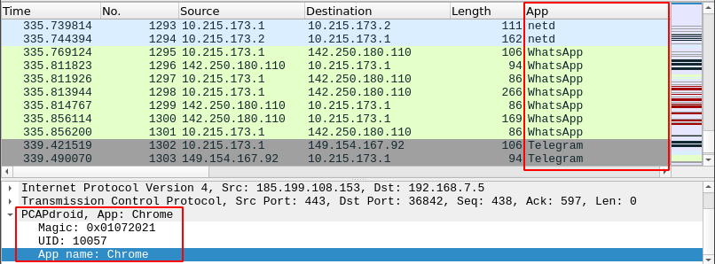
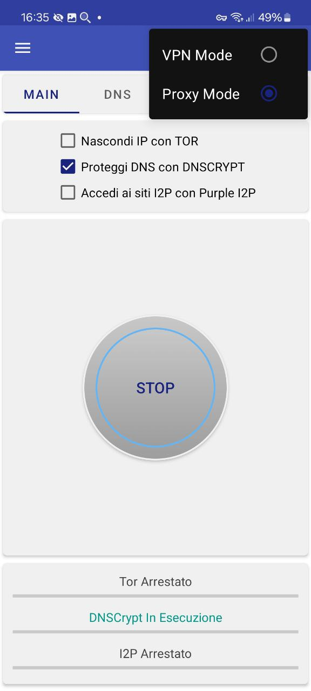
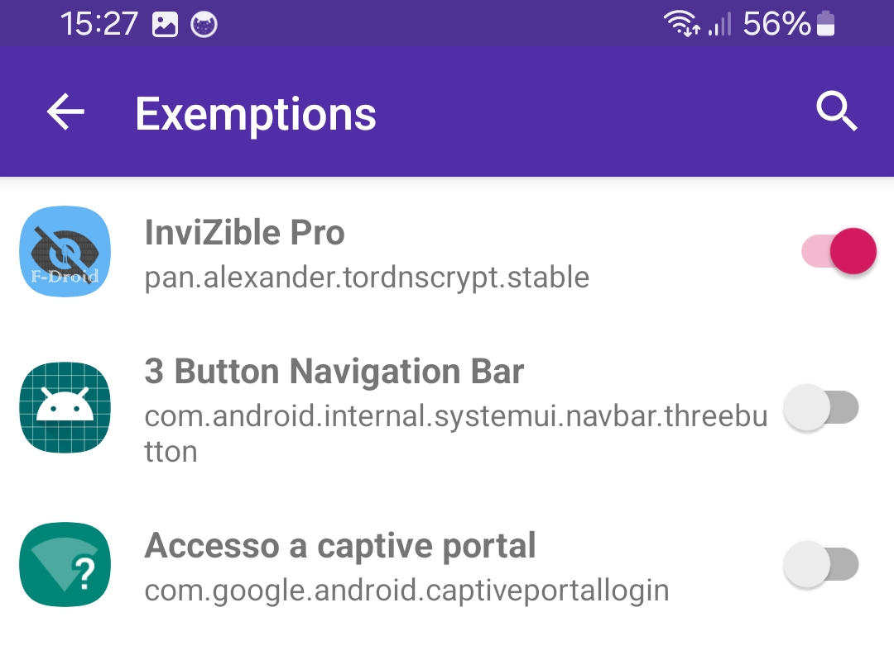
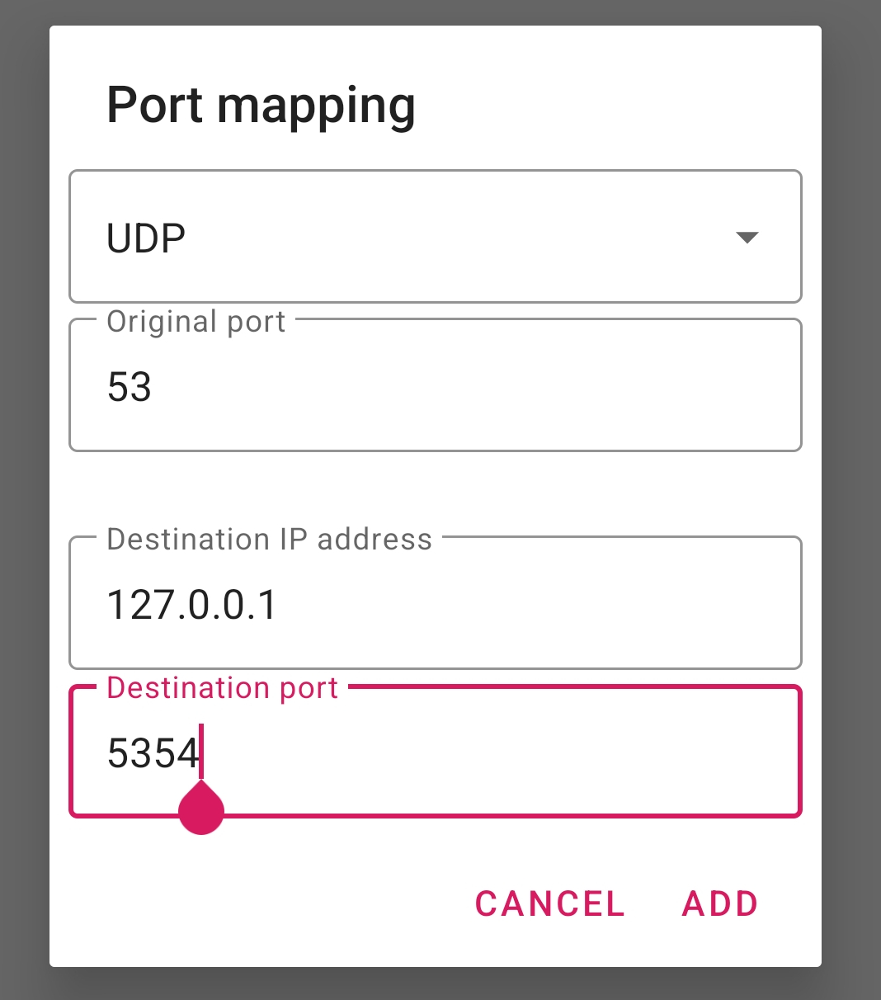
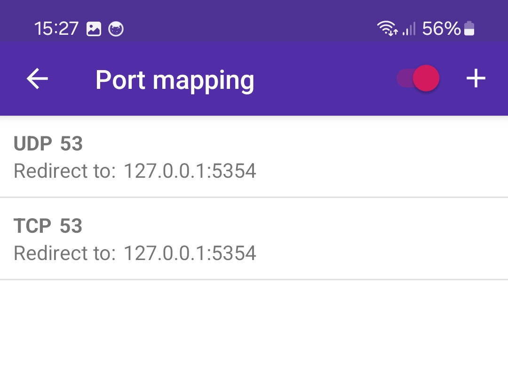
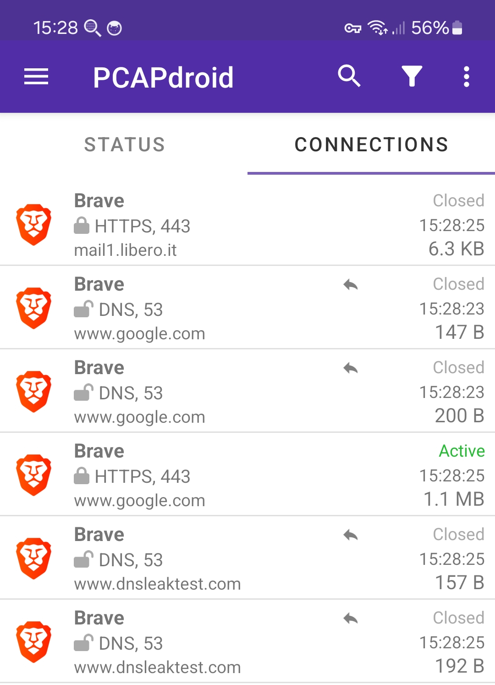
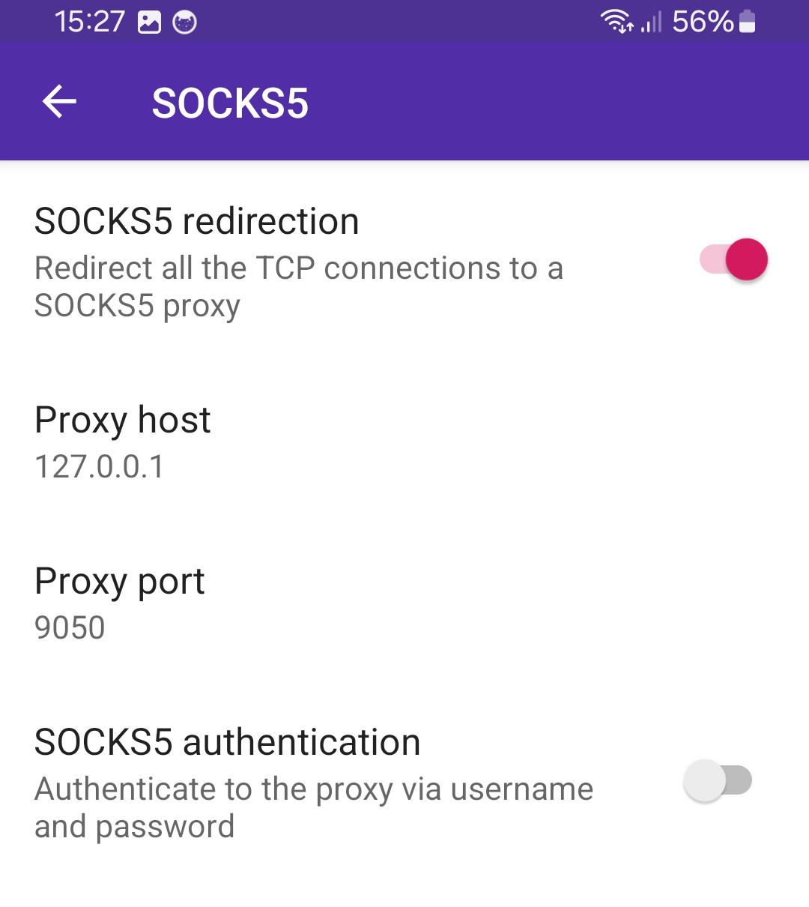

## 4.1 DNS Server

When IPv6 is enabled via the PCAPdroid settings, the IPv6 DNS server `2001:4860:4860::8888` will be used.

For IPv4 connections, PCAPdroid tries to detect the DNS server used by the device and use it. This only works on Android Marshmallow and after.
If the detection fails or the primary data connection (e.g. 4G or WiFi) changes, the `8.8.8.8` DNS server is used. You can review the currently used IPv4
DNS server in the `Stats` page.

## 4.2 DoH Support

PCAPdroid detects and blocks DNS-over-HTTPS requests. This is necessary in order to extract and display the DNS query being sent. The DNS queries are then sent in
cleartext.

## 4.3 IPv6 Support

PCAPdroid supports IPv6 TCP/UDP connections. IPv6 must be manually enabled from the *VPN* settings.
By default, IPv6 is disabled, in which case no IPv6 internet connection will be established (or monitored) when PCAPdroid is active.
When enabled, all the IPv6 unicast traffic will be monitored by PCAPdroid.

In order to avoid getting a "Unreachable" connections errors, IPv6 should only be enabled when the primary data connection (e.g. 4G or WiFi) actually supports IPv6.
In general, you can safely disable IPv6 unless you actually want to monitor an IPv6 service.

## 4.4 Root Capture

Since version 1.3.6, it's possible to capture the network traffic directly from the network interface of the Android device without creating a VPNService. This allows PCAPdroid to run while other VPN apps are running. A rooted device is needed to use this feature.

In this mode, PCAPdroid performs a "raw" capture, meaning that real packets are captured as they appear on the network interface. This means that the limitations described in the [PCAP Reliability section](https://emanuele-f.github.io/PCAPdroid/quick_start#14-pcap-reliability) do not apply. It's important to note, however, that PCAPdroid will skip the Ethernet headers to provide the same PCAP format regardless of the network interface in use.

While common network tools like tcpdump require you to select a specific network interface, PCAPdroid automatically detects the internet-facing interface and it captures the packets from it. Moreover it automatically changes the capture interface when, for example, the device switches from WiFi to the mobile network.

The root capture feature can be enabled from the app settings. It is only displayed when root access is detected, so if you are using magisk hide you will need to whitelist the app. Root permissions will only be asked while starting the capture. PCAPdroid will spawn a daemon process as root and will communicate with it to capture the packets. The daemon will be stopped when the capture is stopped from the app.

Please note that the following limitations apply for this mode:

- The SOCKS5 proxy is not available. This means that the TLS decryption is not available with root capture enabled
- Ethernet data will not be shown
- Domain names for DNS requests sent via DoH will not be visible. You need to disable/block DoH if you want to extract domain names
- The connections status show in PCAPdroid does not currently reflect the actual status of the connections in linux
- Some broadcast/multicast connections may have a wrong traffic direction
- If you apply an app filter, you may miss some DNS traffic generated by the [netd service](https://github.com/emanuele-f/PCAPdroid#what-is-the-netd-app)
- The UID of short-lived connections may be wrongly reported as unknown. When an app filter is set, this may result in some connections to be ignored by the filter. The reasons for this are explained in [this issue](https://github.com/emanuele-f/PCAPdroid/issues/194)

## 4.5 PCAPdroid Trailer

Since version 1.4.0, by enabling the `PCAPdroid Trailer` setting it is possible to add additional metadata to the exported packets. Such metadata includes the app name and UID of the originating process. This information can be processed by third-party monitoring tools e.g. Wireshark.

By using the custom [pcapdroid.lua](https://github.com/emanuele-f/PCAPdroid/blob/master/tools/pcapdroid.lua) plugin, it is possible to interpret the metadata into Wireshark, displaying the metadata fields as columns and even apply them as a filter. The plugin should be placed into [the plugins directory](https://www.wireshark.org/docs/wsug_html_chunked/ChPluginFolders.html) or it can be manually loaded on the linux cli with `-X lua_script:tools/pcapdroid.lua`.

<p align="center">

</p>

When the trailer is enabled, a fake Ethernet header will be added to the packets to encapsulate both the PCAPdroid trailer and the original IP header and data. This makes it possible to recover the original capture data by simply skipping the Ethernet header and removing the Ethernet trailer. The Ethernet trailer is padded with zeros so that the PCAPdroid trailer starts on a 4-bytes boundary. Here is a description of the fields in the PCAPdroid trailer:

| Offset | Size (Bytes) | Name    | Type   | Description                |
|-------:|-------------:|---------|--------|----------------------------|
|      0 |            4 | magic   | uint32 | Trailer magic: 0x01072021  |
|      4 |            4 | uid     | int32  | Process UID, -1 if unknown |
|      8 |           20 | appname | string | App package name           |

The `appname` field contains the app package name truncated to 19 characters, which is useful to quickly spot an app without having to manually resolve it from the uid. The total per-packet overhead when the trailer is enabled is `14 B (Ethernet) + padding + 28 B (trailer) + 4 B (Ethernet FCS) = 46 B + padding`. The padding varies from 0 to 3 bytes.

## 4.6 Js Injector

The Js Injector, which is part of the PCAPdroid mitm addon, allows you to inject Javascript code into web pages. Scripts can be added from the mitm addon UI, by specifying the URL of the script to load.
Scripts contain an header, which specifies the script metadata. It's syntax is similar to [the one used by tampermonkey](https://www.tampermonkey.net/documentation.php?locale=en), but scripts are not compatible. Here is an example:

```js
// @name Alert test
// @description Displays an alert dialog on google.it
// @author Emanuele Faranda
// @version 1.0
// @match *://www.google.it/*

alert("Js Injector works");
```

This script will be injected on web pages matching the `google.it` domain, diplaying an alert dialog. You can use the `*://*/*` match to inject a script to all the web pages.
You can test the above script by adding it via the following URL: [https://pcapdroid.org/alert.js](https://pcapdroid.org/alert.js).
Upon a successful injection, the connetion will be marked in PCAPdroid with a "JS" icon. Opening the connection details will show the name of the injected script.

<p align="center">

</p>

In order to make script injection effective, ensure to:

- Add the browser app or the specific URL to the Decryption list, to decrypt it
- In PCAPdroid, block QUIC. This ensures that web pages are not upgraded to QUIC, whose decryption is not supported yet
- Flush the browser cache, to ensure that the browser does not use a cached web page

## 4.8 DNSCrypt

Since version 1.7.0, you can integrate PCAPdroid with [InviZible Pro](https://f-droid.org/it/packages/pan.alexander.tordnscrypt.stable) to encrypt your DNS traffic with DNSCrypt. In essence this allows you to get visibility on the DNS traffic in PCAPdroid while retaining the privacy benefits provided by DNSCrypt.

To do this, you need to:

1. In the Android network settings, disable the private DNS. This allows PCAPdroid to inspect plaintext DNS traffic
2. Install InviZible Pro, configure it in "Proxy Mode", start it and wait until DNSCrypt is running

<p align="center">

</p>

3. In the PCAPdroid settings, add InviZible to the VPN Exemptions. This is necessary to avoid traffic loops


<p align="center">

</p>

5. Add two port mapping rules to PCAPdroid, one for TCP and one for UDP, to redirect the DNS traffic from port 53 to port 5354, where the InviZible proxy is listening

<p align="center">


</p>

5. Start the PCAPdroid capture. DNS requests should now be redirected to InviZible proxy and then encrypted. In the Connections view, these are marked with a back arrow icon.

<p align="center">

</p>

Your DNS requests should be encrypted now. You can verify this by performing a DNS leak test, e.g. via https://www.dnsleaktest.com, which should show the DNSCrypt DNS servers in place of your ISP ones.
From InviZible you can configure DNSCrypt settings, such as enable/disable DNS-over-HTTPS, enforce DNSSEC, etc.

## 4.9 Tor

To use Tor at the same time as PCAPdroid, you can either use [InviZible Pro](https://f-droid.org/it/packages/pan.alexander.tordnscrypt.stable) or [Orbot](https://play.google.com/store/apps/details?id=org.torproject.android) as the Tor provider. If you use Orbot, ensure to disable the Orbot VPN mode.

Start the Tor provider and open the PCAPdroid SOCKS5 settings. Set the host to 127.0.0.1, the port to 9050 and enable the SOCKS5 proxy.

<p align="center">

</p>

Starting the PCAPdroid capture will now redirect your TCP connections to Tor (NOTE: **not UDP**, see [#212](https://github.com/emanuele-f/PCAPdroid/issues/212)). Your public IP should now be one of the Tor exit nodes.
In this mode, to avoid DNS leaks, it's also adviced to [configure DNSCrypt](#49-dnscrypt) as explained above.
