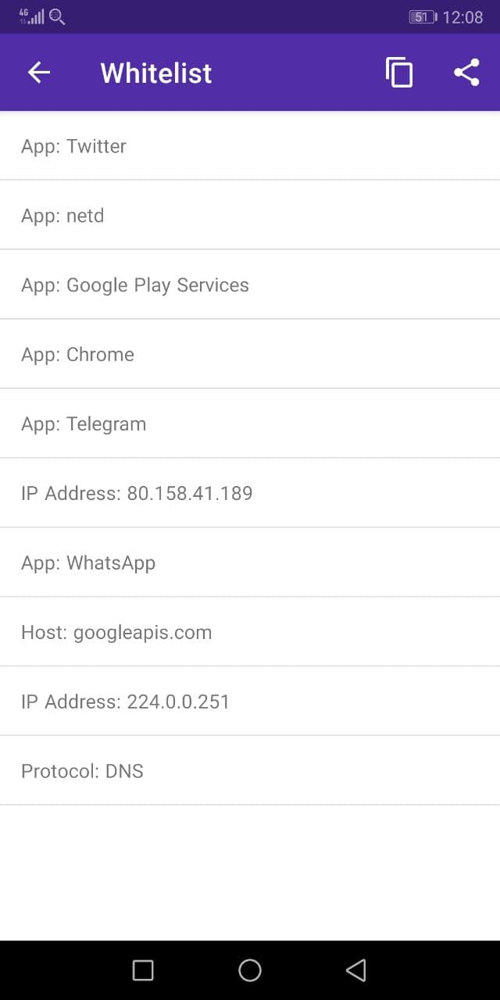

## 1.1 What is PCAPdroid

PCAPdroid is an open source network capture and monitoring tool which works without root privileges. The common use cases include:

- Analyze the connections made by the apps installed into the device, both user and system apps
- Create a PCAP of the network traffic of untrusted apps and send it remotely (e.g. to Wireshark)
- Decrypt the HTTPS/TLS traffic of an app for debugging purposes/reverse engeneering

PCAPdroid leverages the android [VpnService](https://developer.android.com/reference/android/net/VpnService) to receive all the traffic generated by the android apps. No external VPN is actually created, the traffic is locally processed by the app.

**Important**: the PCAP generated by PCAPdroid is not 100% accurate. Check out [PCAP Reliability](https://emanuele-f.github.io/PCAPdroid/quick_start#14-pcap-reliability) for more details.

## 1.2 Basic Usage

In order to start using PCAPdroid, you just need to tap the start button.

On the first start, a VPN confirmation dialog is shown. After accepting it, PCAPdroid will start capturing the traffic. PCAPdroid can be put in background while operating with the other apps as it continues to run as a service until the capture is stopped. As long as PCAPdroid is running, a key icon will be displayed into the android notification bar (this may vary depending on your system). Moreover, a persistent notification is shown, which includes the details about the captured traffic.

By default, an HTTP server is started on port 8080 to serve the traffic PCAP. You can visit the provided URL from another device (e.g. a PC) to start downloading the PCAP. The download is streamed so it's normal to see a 0% download progress indicator in the browser. Only the traffic generated after the download has been started will be captured. It will finish once the stop button in PCAPdroid is pressed. Beware that any user in your local network can download a copy of your device traffic! If you want to avoid this, you can select "None" as the dump mode.

The connections made by the apps can be easily reviewed in the "Connections" tab.

Each row represents an outgoing connection made by an app or by the android system itself. The following information is show:

  - The app icon, or a question mark if the app is unknown
  - The app name
  - The protocol of the connection, its port and IP version (if not IPv4). This is determined by analyzing the raw packets of the connection by using [nDPI](https://github.com/ntop/nDPI).
  - The SNI (server name information) or DNS query, if available. Otherwise, the remote IP address.
  - The connection status indicator, which can be "Open", "Closed", "Error" or "Unreachable".
  - The last seen time, which is the time of the most recent packet of the connection.
  - The total traffic volume of the connection.

By clicking on the connection it is possible to get more details about it.

Some details, like the IP addresses, status and statistics, are always shown. Other information, like the URL or the host, is only shown when available. Among other things, PCAPdroid tries to detect the plain text request data sent at the start of a connection, which will reported in the "Request Plaintext" row when available. For HTTP connections, for example, it will show the HTTP request sent.

During the capture, PCAPdroid logs all the connections in memory. After a limit is reached, old connections will be removed and replaced by new ones and a message indicating the number of discarded connections is shown. An overview of the traffic generated by the apps can be seen in the "Apps" view.

By pressing on an app it is possible to show its individual connections.

## 1.3 Filters

Before the capture is started, in the "Status" tab it is possible to specify an "App Filter" to only capture the traffic of the specified app. Only this app will be routed inside the VPNService. This is expecially useful when using the [TLS decryption](tls_decryption) to ensure that the mitm will only take place on the target app.

After the capture is started, PCAPdroid provides different ways to filter the displayed connections:

- via the search bar, it is possible to filter the connections by IP address, host, protocol, app name, uid or protocol. A convenient way to search the connections is by long pressing a connection and then selecting a filter from the contextual menu.
- from the `Apps` view, it is possible to tap on an app to apply it as a filter
- by long pressing a connection, it is also possible to add it to the *whitelist*

The whitelist feature allows you to create rules to hide groups of connections from the "Connections" tab. By carefully building a whitelist of "good" connections, it is possible to filter out the background noise made by the periodic connections or by the frequently used apps and only display a few relevant connections. This is particularly useful to detect unwanted or possibly malicious connections. The whitelist is persistent and can be modified from the corresponding entry in the left drawer.

## 1.4 PCAP Reliability

*Note: this does not apply when [Root Capture](https://emanuele-f.github.io/PCAPdroid/advanced_features#44-root-capture) is enabled.*

The PCAP generated by PCAPdroid contains some synthetic data and, as such, cannot be reliabily used to perform per-packet analysis. In particular, only the packet payload, IP peers and L3 ports correspond to the actual data. This limitation is intrinsic of the way PCAPdroid, and any non-root capture app in general, work.

Here is a list of some of the limitations:

- All packets coming from the internet contain synthetic IP and TCP/UDP headers
- Some IP and TCP features may be disabled or altered
- Packet sizes will not correspond to the original ones
