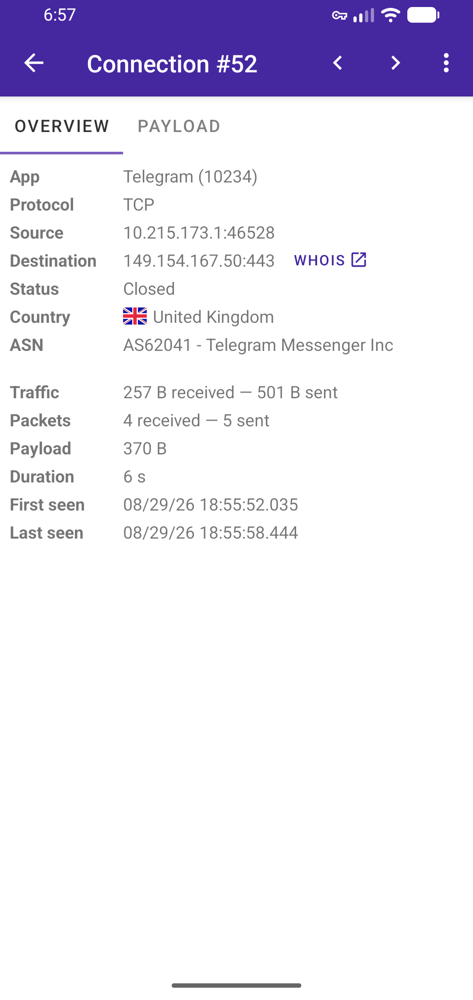
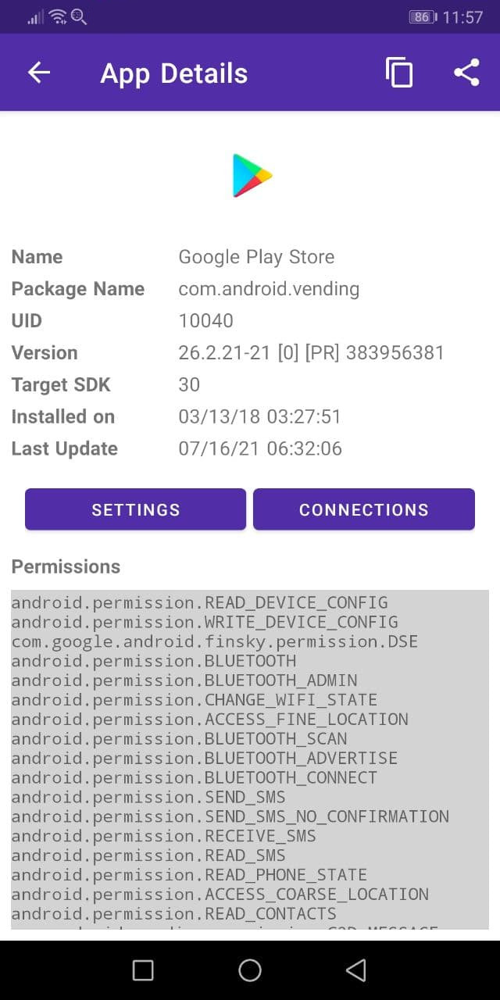
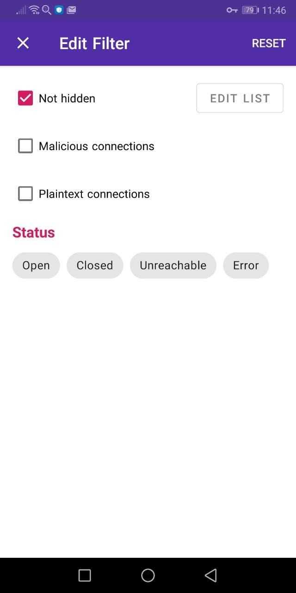

## 1.1 What is PCAPdroid

PCAPdroid is an open source network capture and monitoring tool which works without root privileges. The common use cases include:

- Analyze the connections made by the apps installed on the device, both user and system apps
- Dump the device traffic as a PCAP and send it remotely for further analysis (e.g. to Wireshark)
- Decrypt the HTTPS/TLS traffic of a specific app

PCAPdroid leverages the Android [VpnService](https://developer.android.com/reference/android/net/VpnService) to receive all the traffic generated by the Android apps. No external VPN is actually created, the traffic is processed locally by the app.

If you plan to use PCAPdroid to perform packet analysis, check out [the related section](#14-packet-analysis) below.

## 1.2 Basic Usage

In order to start using PCAPdroid, you just need to tap the play button in the action bar.

On the first start, a VPN confirmation dialog is shown. After accepting it, PCAPdroid will start capturing the traffic. PCAPdroid can be put in the background while operating with other apps as it continues to run as a service until the capture is stopped. As long as PCAPdroid is running, a key icon will be displayed in the Android notification bar (this may vary depending on your system). Moreover, a persistent notification is shown, which includes the details about the captured traffic.

By default, the captured traffic is not exported anywhere, it is only analyzed inside the app. If you want to export it, use the *dump mode* selector in the "Status" tab, e.g. to save the traffic into a [PCAP file](#15-packet-captures) or to serve it via an HTTP server. Check out the [dump modes](dump_modes) chapter to review all the available options.

The connections made by the apps can be easily reviewed in the "Connections" tab.

Each row represents an outgoing connection made by an app or by the Android system itself. The following information will be shown:

  - The app icon, or a question mark if the app is unknown
  - The app name
  - The protocol of the connection, its port and IP version (if not IPv4). This is determined by analyzing the raw packets of the connection by using [nDPI](https://github.com/ntop/nDPI).
  - The SNI (Server Name Indication) or DNS query, if available. Otherwise, the remote IP address.
  - The connection status indicator, which can be "Open", "Closed", "Error" or "Unreachable".
  - The last seen time, which is the time of the most recent packet of the connection.
  - The total traffic volume of the connection.

**Note**: it's normal to have an "unknown" app being listed by PCAPdroid. See the [FAQ](faq) for details.

By clicking on the connection it is possible to get more details about it.

Some details, like the IP addresses, status and statistics, are always shown. Other information, like the contacted domain name, is only available for some protocols (e.g. HTTP or TLS). The URL is only available for plaintext HTTP connections, which are quite rare as the majority of the Internet traffic is encrypted. To get the URL for HTTPS/TLS connections, you need to decrypt the connection; check out the [TLS decryption section](tls_decryption) for more details.

During the capture, PCAPdroid logs all the connections in memory. After a limit is reached, old connections will be removed from the memory and replaced by the new ones and a message indicating the number of discarded connections is shown. If you want to keep a longer log of connections, you can increase the "Max logged connections" limit under the PCAPdroid settings.

An overview of the traffic generated by the apps can be seen in the "Apps" view.

By pressing on an app, its details page will open, where it's possible to review its metadata, like the installation date, version and permissions.

By clicking on the "Settings" button, the system settings for the app will open. The "Connections" button provides a shortcut to show the connections made by the app.

## 1.3 Filters

Before the capture is started, in the "Status" tab it is possible to specify an "App Filter" to only capture the traffic of the specified app. Only this app will be routed inside the VpnService. This is especially useful when using the [TLS decryption](tls_decryption) to ensure that the mitm will only take place on the target app.

After the capture is started, PCAPdroid provides different ways to filter the displayed connections:

- via the search bar, it is possible to filter the connections by IP address, host, protocol, app name or UID. A convenient way to search the connections is by long pressing a connection and then selecting a filter from the contextual menu.
- via one of the filters of the "Edit Filter" dialog
- by long pressing a connection, it is also possible to *hide* it. The connection will be added to a list of "Hidden Connections", which can be reviewed and modified from the "Edit Filter" dialog.
- from the "Apps" view, it is possible to tap on an app to apply it as a filter

The "Hidden Connections" filter allows you to create rules to hide groups of connections from the "Connections" tab. By carefully building a list of "good" connections, it is possible to filter out the background noise made by the periodic connections or by the frequently used apps and only display a few relevant connections. This is particularly useful to detect unwanted or possibly malicious connections. The list is persistent.

The "Edit Filter" dialog allows you to specify filters for the connections list:

- *Not hidden*: if selected, only connections not matching the "Hidden Connections" rules will be shown. The rules can be modified by clicking on the "Edit List" button.
- *Malicious connections*: only display malicious connections. This is only displayed if the [malware detection feature](paid_features#52-malware-detection) is enabled.
- *Plaintext connections*: only display connections which contain a "Request Plaintext" (they are not encrypted and their data is printable).
- *Status*: only display connections in this status

The active filters are shown via chips above the connections list, which provide a convenient way to remove existing filters.

## 1.4 Packet Analysis

If you need to perform a low level analysis on the L3 or L4 headers of the packets or on the size/timing of packets, then the non-root capture may not be appropriate for your task. You should instead use the [root capture](advanced_features#44-root-capture), which provides an almost 1:1 view of the traffic of your device without any modifications.

When running in non-root mode, PCAPdroid alters the network traffic, which is a required step in order to capture it via the VpnService. The modifications only affect the L3 and L4 layers of the packets, whereas the L7 data is untouched. In particular:

- All packets coming from the Internet contain synthetic IP and TCP/UDP headers. Only the destination IP addresses and ports correspond to the actual connection.
- While proxying connections, some IP and TCP features may be disabled or altered.
- Because PCAPdroid proxies connections using L4 sockets, packet sizes for packets coming from the Internet will not correspond to the original ones.

Moreover, in non-root mode, only outgoing connections (i.e. started by the Android device) are routed into the VpnService and captured. For a technical explanation of why this happens, check out the [how_it_works](https://github.com/emanuele-f/PCAPdroid/blob/master/docs/how_it_works.md) document.

Please note that, even when capturing packets in root mode, the packets you see in the capture are not 1:1 with the real packets on the wire; for example, you may see packets much bigger than the interface MTU. This behaviour is not something specific to PCAPdroid or Android. It can occur because packets are usually aggregated by kernel/NIC offloading technologies like GSO, GRO and TSO. As a result, capture tools like PCAPdroid and tcpdump will see packets in their aggregated form rather than as the individual MTU-sized packets that are ultimately transmitted on the wire.

## 1.5 Packet Captures

To capture traffic and store it into a PCAP/Pcapng file, you need to select "PCAP file" as the [dump mode](dump_modes#23-pcap-file).

After starting the capture, the traffic will be recorded to a file under the `PCAPdroid` subfolder of the `Downloads` directory.
After the capture is stopped, it will also appear in the "Last capture" section at the bottom of the screen, along with its size, the time when it was captured, its duration and an indication of the captured apps. Clicking "View all" will bring you to the Capture list screen.

The capture list gives you an overview of all the captures done previously and currently stored on the device storage. You can review the total storage used, rename or delete them in bulk. By clicking on a capture, you can load it back into PCAPdroid for analysis. A green open lock icon indicates that the capture contains decrypted traffic (see [TLS decryption](tls_decryption)).

For the best experience, consider purchasing the [Pcapng format](paid_features#53-pcapng-format). When enabled, it allows you to store additional metadata into the captures via the [PCAPdroid Extensions](advanced_features#45-pcapdroid-extensions), e.g. application UIDs, packet directions and the TLS master secrets used for the traffic decryption. This makes traffic analysis much easier, both in PCAPdroid itself and in external tools like Wireshark.
