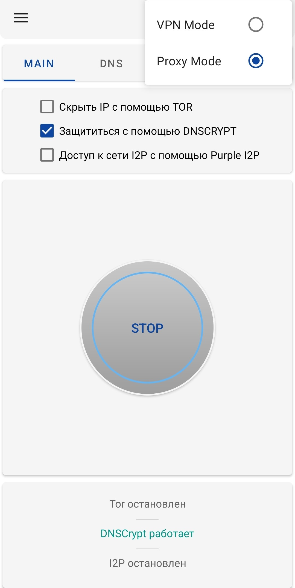
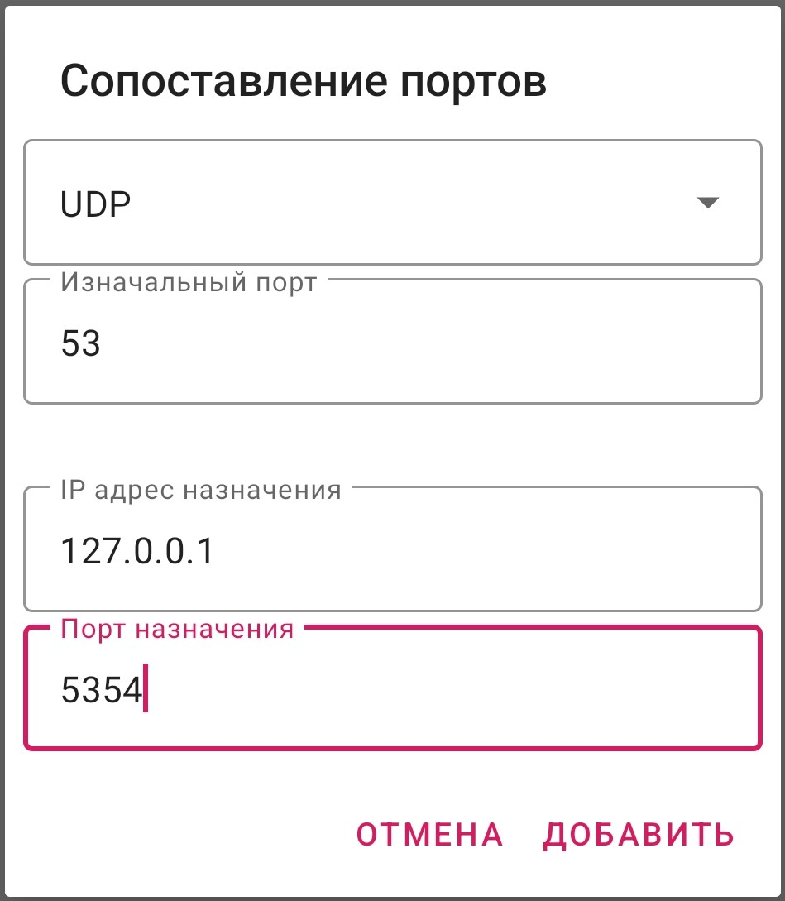
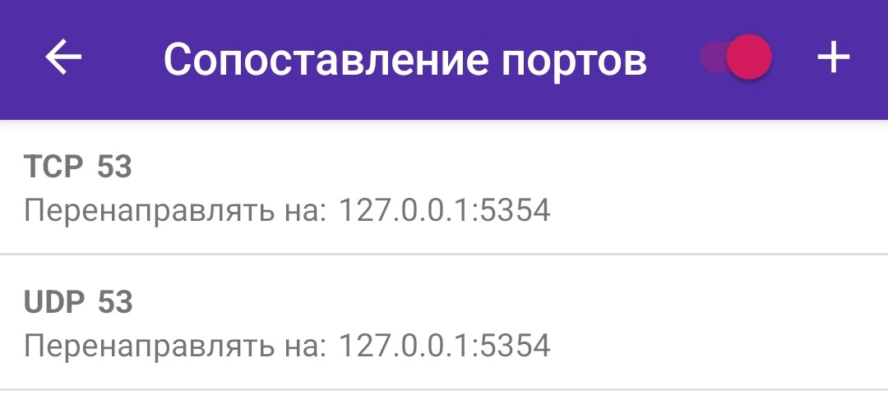
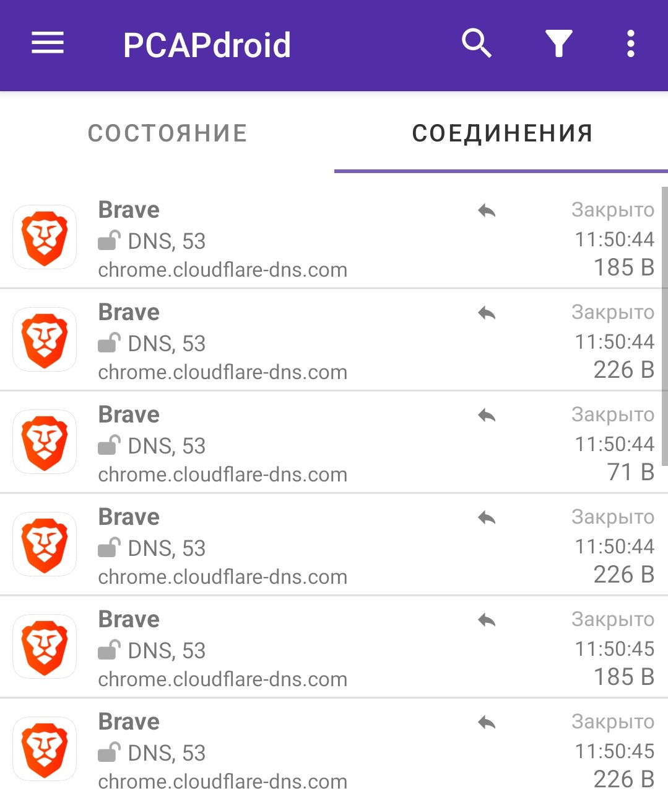
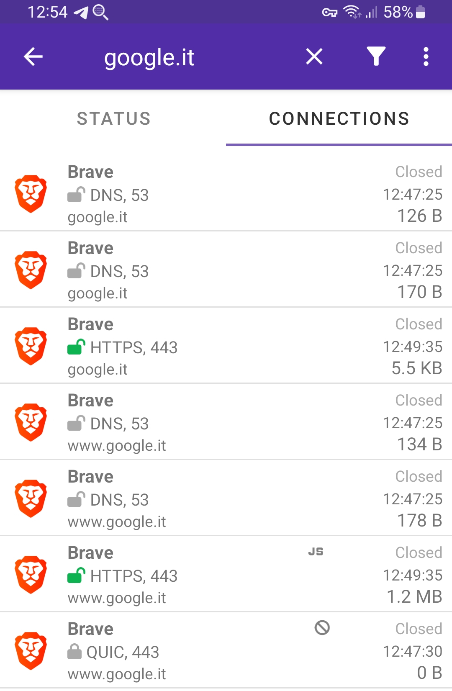
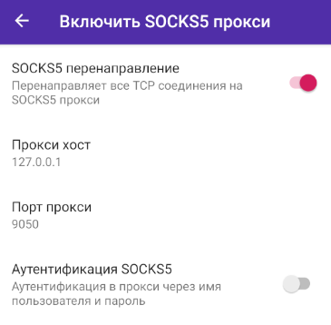

**[Оглавление](index)	>	Расширенные возможности**

## 4.1 DNS Сервер

Если в настройках  PCAPdroid включен протокол IPv6, будет использоваться следующий IPv6 DNS сервер -  `2001:4860:4860::8888`.

Для IPv4 соединенией PCAPdroid старается определить каким DNS сервером пользуется устройство и использовать его. Это работает только на Android 6 (Marshmallow) и новее.
Если же обнаружение не удается или основное подключение к сети (например 4G или WiFi) изменяется, будет использован DNS сервер `8.8.8.8` (от Google). Вы можете увидеть используемый на текущий момент DNS сервер в разделе "Показатели" бокового меню PCAPdroid.

## 4.2 Поддержка DoH

PCAPdroid обычно обнаруживает и блокирует DNS-over-HTTPS запросы. Это требуется для того, чтобы извлекать и отображать отправляемые DNS-запросы.

Начиная с версии 1.7.0 вы можете настроить интеграцию PCAPdroid и [InviZible Pro](https://f-droid.org/ru/packages/pan.alexander.tordnscrypt.stable) чтобы шифровать DNS трафик с помощью DNSCrypt или DoH. По сути, это позволяет отображать информацию о DNS-запросах, при этом не отказываясь от преимуществ по конфиденциальности, предоставляемых протоколами DNSCrypt и DoH.

Чтобы сделать это, вам необходимо:

1\. В настройках сети Android отключите использование частного DNS. Это позволит PCAPdroid проверять DNS запросы, передаваемые в открытом виде

2\. Установите InviZible Pro, настройте его для работы в режиме прокси, запустите и дождитесь пока DNSCrypt запустится

  <p align="center">
  
  </p>

3\. В настройках PCAPdroid добавьте InviZible в исключения VPN. Это необходимо для избежания зацикливания трафика
  <p align="center">
  
  </p>

4\. Добавьте два правила сопоставления портов в PCAPdroid, по одному для TCP и UDP, чтобы перенаправлять DNS трафик с порта 53 на порт 5354, на котором слушает InviZible
  <p align="center">
  
  
  </p>

5\. Запустите захват в PCAPdroid. Теперь DNS запросы должны перенаправляться в прокси InviZible и затем шифроваться. Во вкладке Соединения такие отмечены значком стрелки
  <p align="center">
  
  </p>

Теперь ваши DNS-запросы должны быть зашифрованы. Вы можете убедиться в этом проведя тест на утечку DNS, например через [https://www.dnsleaktest.com](https://www.dnsleaktest.com), который в свою очередь должен теперь отобразить сервера DNSCrypt вместо ваших исходных.
В настройках InviZible вы можете задать некоторые настройки DNSCrypt, такие как включение/выключение DNS-over-HTTPS, применение DNSSEC и так далее.


## 4.3 Поддержка IPv6

PCAPdroid поддерживает протокол IPv6 с соединениями TCP/UDP. IPv6 должен быть вручную включен из настроек.
По умолчанию IPv6 выключен, в этом случае никаких соединений по данному протоколу устанавливаться не будет до тех пор пока активен захват трафика в PCAPdroid.
Когда IPv6 включен, весь одноадресный IPv6 трафик будет захватываться в PCAPdroid.

Во избежание получения ошибок соединений с меткой "Недоступно", IPv6 должен быть включен исключительно если ваше основное соединение (т.е.. 4G или WiFi) действительно поддерживают IPv6.
В целом вы можете спокойно отключить IPv6 до тех пор пока вам не потребуется захватить трафик именно от IPv6 сервиса.

## 4.4 Захват трафика с правами Root

Начиная с версии 1.3.6, стало возможным перехватывать трафик напрямую с сетевого интерфейса, без использования VPN сервиса в системе. Это позволяет PCAPdroid работать даже тогда, когда запущены какие-либо VPN приложения. Однако для такой возможности необходимо устройство с Root-доступом.

В данном режиме PCAPdroid работает с трафиком напрямую. Это означает что перехватываются реальные пакеты в том виде, в каком они попадают на сетевой интерфейс. Это в свою очередь значит что ограничения описанные в [разделе Надежность PCAP](quick_start#14-надежность-pcap) не распространяются на этот режим. Однако стоит помнить, что PCAPdroid пропускает некоторые заголовки чтобы предоставлять одинаковый формат PCAP независимо от используемого сетевого интерфейса.

Пока большинство сетевых инструментов наподобии tcpdump требуют от вас указать конкретный сетевой интерфейс, PCAPdroid автоматически определяет интерфейсы с доступом в сеть и перехватывает пакеты с них. Более того, PCAPdroid автоматически меняет интерфейс с которого ведется захват когда, например, устройство переключается с Wi-Fi на мобильную сеть.

Захват в Root-режиме может быть включен из настроек приложения. Этот пункт будет отображаться только если на устройстве будет обнаружен Root-доступ, поэтому если вы используете Magisk Hide, вам будет необходимо добавить PCAPdroid в его белый список. Root-права могут быть запрошены только после старта захвата. PCAPdroid создаст сервис посредством Root-прав и будет коммуницировать с этим сервисом для захвата пакетов. Сервис будет остановлен как только вы завершите захват трафика в приложении.

Пожалуйста помните о следующих ограничениях, применимых к данному методу::

- SOCKS5 прокси не доступен. *Это означает что использовать расшифровку TLS при захвате с root-правами невозможно*.
- Ethernet-данные не будут отображены
- Доменные имена из DNS запросов отправленных посредством DNS-over-HTTPS не будут видны. Если Вам важно их видеть - отключите/запретите использование DNS-over-HTTPS в целевом приложении.
- Статусы соединений отображаемые PCAPdroid на текущий момент не соответствуют актуальным статусам соединений в linux
- Некоторые широковещательные/многоадресные соединения могут иметь некорректное направление трафика
- Если вы используете фильтр приложений, вы можете упустить DNS трафик генерируемый [сервисом netd](https://github.com/emanuele-f/PCAPdroid#what-is-the-netd-app).

## 4.5 PCAPdroid Расширения

Включая опцию `PCAPdroid расширения` (называлась `PCAPdroid trailer` в старых версиях) добавить дополнительные метаданные в экспортируемые пакеты. Такие метаданные включают название приложения и UID исходного процесса. Данная информация может быть обработана сторонними инструментами мониторинга, например Wireshark.


Используя плагин [pcapdroid.lua](https://github.com/emanuele-f/PCAPdroid/blob/master/tools/pcapdroid.lua) указанные выше метаданные можно интерпретировать в Wireshark, отображая их в качестве столбцов и даже давая возможность применять их в фильтрах. Плагин должен быть расположен в [папке для плагинов Wireshark](https://www.wireshark.org/docs/wsug_html_chunked/ChPluginFolders.html) или же может быть вручную загружен в linux из терминала с использованием опции `-X lua_script:tools/pcapdroid.lua`.

<p align="center">

</p>

### Формат PCAP

При записи дампа в формат PCAP, включение PCAPdroid расширений добавит ложный Ethernet-заголовок к пакетам, чтобы инкапсулировать и PCAPdroid trailer и исходные IP-заголовки и данные. Это позволяет восстановить исходные данные простым пропуском Ethernet заголовка и удалением Ethernet trailer. Ethernet trailer дополняется нулями, чтобы PCAPdroid trailer имел 4-байтовое смещение. Ниже представлено описание полей в добавляемом PCAPdroid trailer:

| Смещение | Размер (в байтах) | Имя     | Тип    | Описание                                |
|---------:|------------------:|---------|--------|-----------------------------------------|
|        0 |                 4 | magic   | uint32 | Trailer magic: 0x01072021               |
|        4 |                 4 | uid     | int32  | UID процесса, -1 если процесс незвестен |
|        8 |                20 | appname | string | Название приложения                     |

Поле `appname` содержит название приложения, урезанное до 19 символов, что достаточно полезно для быстрого поиска трафика приложения без необходимости вручную сопоставлять приложения с их UID. Итоговый размер пакета с дополнительными метаданными составляет`14 B (Ethernet) + 28 B (trailer) + 4 B (Ethernet FCS) = 46 B + дополнение`. Дополнение варьируется от 0 до 3 байт.

### Формат Pcapng

При записи дампа в [формат Pcapng](https://emanuele-f.github.io/PCAPdroid/paid_features#53-pcapng-format), метаданные из PCAPdroid добавляются как [кастомные блоки Pcapng](https://www.ietf.org/archive/id/draft-tuexen-opsawg-pcapng-04.html#name-custom-block-2) с помощью [62652 PEN](https://www.iana.org/assignments/enterprise-numbers/?q=62652). В частности:

- для каждого обнаруженного приложения добавляется `pcapng_pd_uid_map_block`. Там содержатся UID, названия пакета и приложения
- для каждого пакета в [расширенные блоки пакетов](https://www.ietf.org/archive/id/draft-tuexen-opsawg-pcapng-04.html#name-enhanced-packet-block-2) добавляется [опция комментария](https://www.ietf.org/archive/id/draft-tuexen-opsawg-pcapng-04.html#name-options-2) в форме "u-*uid*", где *uid* это числовое значение UID

Это позволяет сэкономить некоторое место, т.к. информация о приложении будет сохраняться 1 раз и в дальнейшем может быть получена через UID. Посмотрите [pcap_dump.h](https://github.com/emanuele-f/PCAPdroid/blob/master/app/src/main/jni/core/pcap_dump.h) и [pcapdroid.lua](https://github.com/emanuele-f/PCAPdroid/blob/master/tools/pcapdroid.lua) для дополнительной информации.


## 4.6 Js Injector

Аддон Js Injector, являющийся частью PCAPdroid mitm дополнения, позволяет Вам внедрять свой Javascript-код в веб-страницы. Скрипты могут быть добавлены через интерфейс mitm дополнения, указав путь к скрипту, который должен быть загружен.
Скрипт содержит заголовок, где указаны метаданные. Его синтаксис схож с [используемым в tampermonkey](https://www.tampermonkey.net/documentation.php?locale=ru), но скрипты не совместимы. Вот пример:

```js
// @name Alert test
// @description Displays an alert dialog on google.it
// @author Emanuele Faranda
// @version 1.0
// @match *://www.google.it/*

alert("Js Injector works");
```

Этот скрипт будет внедрен на веб-страницу соответствующую домену `google.it`, отображая всплывающее окно. Вы можете использовать `*://*/*` чтобы внедрять скрипт на все веб-страницы.
Вы можете протестировать скрипт выше добавив его по следующему адресу: [https://pcapdroid.org/alert.js](https://pcapdroid.org/alert.js).
После успешного внедрения соединение будет помечено в PCAPdroid значком "JS". Открыв детали соединения вы можете увидеть название внедренного скрипта.

<!-- TODO сделать скриншот -->
<p align="center">

</p>

Чтобы внедрение было эффективным, убедитесь что:

- Добавьте приложение браузера или конкретный URL в правила дешифрования
- В самом PCAPdroid, заблокируйте QUIC в настройках. Это предотвратит переключение на QUIC, дешифрование которого в данный момент не поддерживается
- Очистите кеш браузера, чтобы убедиться, что браузер не будет использовать кешированную страницу

## 4.7 Tor

Чтобы использовать Tor одновременно с PCAPdroid, вы можете использовать либо [InviZible Pro](https://f-droid.org/ru/packages/pan.alexander.tordnscrypt.stable) или [Orbot](https://play.google.com/store/apps/details?id=org.torproject.android) в качестве поставщика Tor. Если вы выберете Orbot, убедитесь что выключили для него режим VPN.

Запустите поставщика Tor и откройте настройки SOCKS5 в PCAPdroid. Укажите хост `127.0.0.1`, порт `9050` и включите опцию SOCKS5 прокси.

<p align="center">

</p>

Запуск захвата трафика в PCAPdroid теперь будет перенаправлять ваши TCP соединения в Tor (ВАЖНО: **не UDP**, ознакомьтесь с [issue #212](https://github.com/emanuele-f/PCAPdroid/issues/212)). Ваш публичный IP теперь должен принадлежать одному из выходных узлов сети Tor.
В этом режиме, чтобы избежать утечек DNS, также рекомендуется [настроить DNSCrypt](#42-поддержка-doh) как пояснялось выше.
