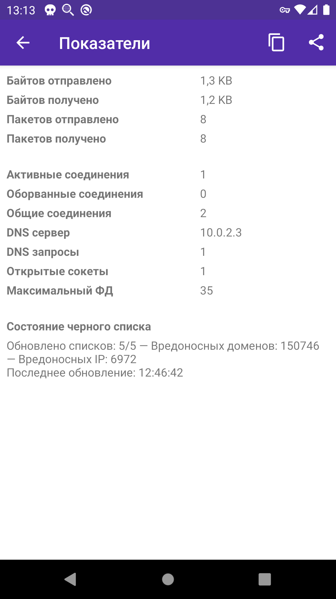
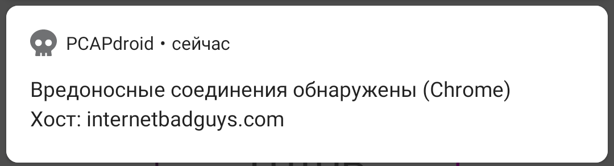

**[Оглавление](index)	>	Платные возможности**

Платные возможности доступны только когда приложение установлено [через Google Play](https://play.google.com/store/apps/details?id=com.emanuelef.remote_capture). Если Вы пользователь F-Droid и у вас есть какие-либо предложения про возможность приема платежей через сборки для F-Droid, пожалуйста [свяжитесь со мной по e-mail](mailto:black.silver@hotmail.it?subject=PCAPdroid)

## 5.1 Обнаружение вредоносных соединений

**Дисклеймер**: *Функционал обнаружения вредоносных соединений в PCAPdroid не является комплесным решением для обеспечения безопасности устройства. Автор не предоставляет никаких гарантий относительно возможностей обнаружения вредоносных соединений или их точности в PCAPdroid, и не несет ответственности за любой прямой или косвенный ущерб причиненный использованием данной возможности.*

Функция обнаружения вредоносов позволяет PCAPdroid обнаруживать соединения с вредоносными хостами благодаря сторонним черным спискам. Обнаружение активно только во время захвата трафика.

Сегодня перед нашими устройствами стоит множество угроз: фишинг, онлайн мошенничество, вымогатели и слежка, а так же множество других. Когда заходит вопрос о безопасности, осторожности никогда не бывает достаточно и ни одно решение не покроет все возможные случаи. Возможность обнаружения вредоносов в PCAPdroid может помочь обнаруживать вредоносные соединения по мере появления таковых, тем самым обращая внимание пользователя на возможную угрозу.

Некоторые случаи в которых эта возможность применима: Here are some contexts where it finds applicability:

- Пользователь посещает известный опасный сайт (например фишинговый или мошеннический)
- Пользователь устанавливает некое приложение или дополнение (которое оказывается шпионит) которое соединяется с опасным доменом или IP адресом
- На устройство любым образом попадает вредонос (например шпион, вымогатель или ботнет), который соединяется с опасным доменом или IP адресом

Черные списки используемые в PCAPdroid содержат списки доменов и IP адресов с плохой репутацией. Они включают сканнеры, брутфорсеров и известные источники распространения вредоносного ПО. Черные списки в основном содержат статические правила, основанные на последних данных о заражениях, а так же некоторые динамические правила, которые сгенерированы автоматически, обычно благодаря [АСООС](https://ru.wikipedia.org/wiki/Client_honeypot)(англ. [Client Honeypots](https://en.wikipedia.org/wiki/Client_honeypot)). PCAPdroid обновляет списки раз в сутки, чтобы иметь возможность обнаруживать актуальные вредоносные соединения.

Состояние черных списков отображается на экране `Показатели`:

- *Обновлено списков*: указывает количество обновленных черных списков. Если с обновление какого-либо из них возникнет проблема - будет использована предыдущая версия списка.
- *Вредоносных доменов*: сообщает о количестве уникальных правил работающих по доменам.
- *Вредоносных IP*: сообщает о количестве правил работающих по IP-адресам и подсетям. Некоторые IP могут уже присутствовать в других списках, так что этот показатель всего лишь верхняя граница.
- *Последнее обновление*: сообщает время последнего обновления черных списков.

Когда вредоносное соединение обнаружено, пользователю сообщается об этом с помощью уведомления. Вы можете проверить работу уведомления посетив сайт [www.internetbadguys.com](http://www.internetbadguys.com).

В уведомлении сообщается какое приложение выполнило соединение с доменом или IP адресом из черного списка. Во избежание засорения области уведомлений срабатываниями, в уведомлении будет сообщено только о последнем вредоносном соединении для конкретного приложения.

По клику на уведомление будет открыт список всех вредоносных соединений сделанных приложением указанным в уведомлении.

Фильтр отображающий вредоносные соединения может быть включен в любое время через диалог изменения фильтров. При завершении захвата траффика данные о вредоносных соединениях будут утеряны.

Если вы ловите ложное срабатывание, удерживайте его в списке соединений (долгое нажатие) и вы сможете добавить его в белый список по таким критериям как IP, домен или даже приложение. После добавления соединений в белый список, он будет применен заново, и все соединения отвечающие правилам белого списка более не будут помечаться как вредоносные. Белый список вредоносов доступен из бокового меню слева.
