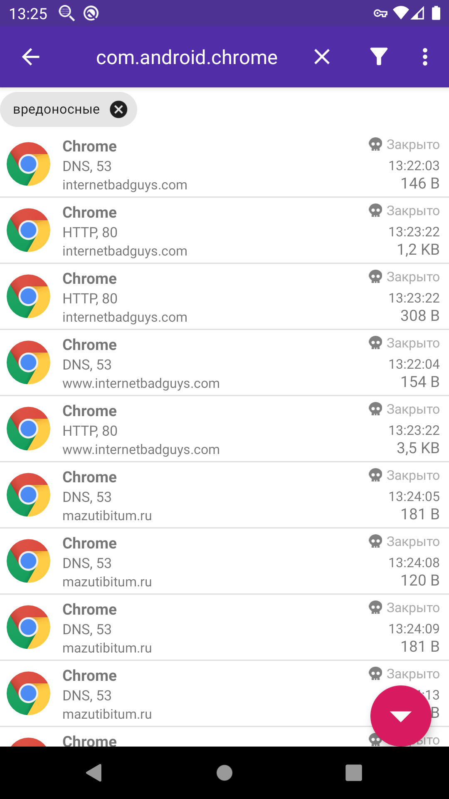

**[Оглавление](index)	>	Платные возможности**

Платные возможности доступны только когда приложение установлено [через Google Play](https://play.google.com/store/apps/details?id=com.emanuelef.remote_capture). Если Вы пользователь F-Droid и у вас есть какие-либо предложения про возможность приема платежей по всему миру через сборки для F-Droid, пожалуйста [свяжитесь со мной по e-mail](mailto:black.silver@hotmail.it?subject=PCAPdroid)

## 5.1 Файрвол

<!-- TODO сверить все термины раздела с актуальными значениями строк в переводе приложения -->

**ПРИМЕЧАНИЕ**: функционал файрвола не доступен при захвате в [root-режиме](advanced_features#44-захват-траффика-с-правами-root)

Функционал файрвола дополняет возможность просмотра траффика в PCAPdroid возможностью блокировать соединения. Такая комбинация становится мощным инструментом для повышения конфиденциальности.

Большинство приложений реализуют нечто вроде аналитики и периодически "стучатся домой", возможно, отсылая конфиденциальные сведения. Во время мониторинга траффика в PCAPdroid, Вы могли заметить, что даже некоторые системные приложения, вроде камеры или галереи, выходят в интернет, что как минимум - неожиданно. По причине того, что большая часть траффика зашифрована, становится затруднительно определить что за информация уходит на удаленный сервер и действительно ли данное соединение необходимо для реализации какого-либо функционала в приложении, или же оно используется только для отправки аналитики.

PCAPdroid позволяет Вам определить собственный набор правил блокировки доступа в интернет для отдельных приложений, доменов или IP-адресов. Это дает Вам возможность гибко выбирать что блокировать, будь то приложение в целом, если Вы считаете что оно не должно иметь доступа в интернет, или определенные домены, если приложение нуждается в доступе в интернет для корректной работы, но Вы все равно хотите заблокировать отдельные домены, которые по Вашим подозрениям могут влиять на конфиденциальность. 

Для добавления правила блокировки, удерживайте необходимое соединение во вкладке "Соединения", нажмите "Заблокировать" и выберите что именно блокировать - приложение, IP-адрес или хост. Блокировка домена второго уровня вроде `example.org` приведет к блокировке всех его субдоменов (например `some.example.org` и `img.example.org`). Это правило применяется только к доменам второго уровня, поэтому блокировка `another.example.org` *не будет* блокировать `yet.another.example.org`.

Правила блокировки будут применены и к активным соединениям, и к новым. Значок *бана / запрета* помогает определять заблокированные соединения. Вы можете легко отобразить все заблокированные соединения нажав на значок фильтра в экшн-баре и применив фильтр *Заблокировано* в группе фильтров *Файрвол*. Вы можете разблокировать соединение долгим нажатием на соединение и выбрав *разблокировать* в контекстном меню. При разблокировке приложения Вы можете решить - разблокировать его навсегда, убрав из списка блокировки, или же разблокировать временно, автоматически заблокировав обратно спустя несколько часов. Вы можете так же просмотреть и удалить правила блокировки из списка, как описано ниже.

Из левого бокового меню Вы можете перейти в раздел файрвола, увидеть его статус и настройки.

Во вкладке *Состояние* Вы можете увидеть статистику по файрволу, вроде количества заблокированных соединений и время последнего заблокированного соединения. Нажмите на карточку "Заблокированные соединения" чтобы отобразить их список. Через переключатель вкл/выкл в экшн-баре вы можете включать/выключать файрвол в текущий момент. Из экшн-бара вы можете так же активировать возможность *блокировки недавно установленных приложений*. Эта опция будет автоматически добавлять в список блокировки новые приложения и блокировать их траффик пока они установлены.

Во вкладке *Список для блокировки* Вы можете увидеть набор правил блокировки. Посредством долгого нажатия Вы можете выделить и удалить их. Вы также можете экспортировать правила в файл, чтобы сделать бекап или поделиться с другими людьми, которые могут добавить их к своим наборам правил.

Вы так же можете блокировать приложения прямо с окна *Приложения*, опять же, через долгое нажатие. Заблокированные приложения можно обнаружить по значку *бана*.

При блокировке приложения, помните о следующем:

- Приложение все еще будет способно производить разрешение доменов (DNS-траффик). В ОС Android, сервис `netd` занимается разрешением доменов от имени приложений, поэтому невозможно определить какое именно приложение сделало DNS-запрос
- Приложение может продолжать коммуницировать с сервисами Google посредством межпроцессного взаимодействия, например получать push-уведомления и отображать рекламу
- Приложение может отображать локально кешированный контент (например закешированная веб-страница)
- Приложение может запускать загрузки с помощью [Диспетчера загрузок](https://developer.android.com/reference/android/app/DownloadManager)

## 5.2 Обнаружение вредоносных соединений

**Дисклеймер**: *Функционал обнаружения вредоносных соединений в PCAPdroid не является комплесным решением для обеспечения безопасности устройства. Автор не предоставляет никаких гарантий относительно возможностей обнаружения вредоносных соединений или их точности в PCAPdroid, и не несет ответственности за любой прямой или косвенный ущерб причиненный использованием данной возможности.*

Функция обнаружения вредоносов позволяет PCAPdroid обнаруживать соединения с вредоносными хостами благодаря сторонним черным спискам. Обнаружение активно только во время захвата трафика. Начиная с версии **1.4.5** при работе в стандартном (VPN) режиме PCAPdroid так же будет блокировать весь траффик направляемый на вредоносные хосты и получаемый с них. Блокировка *не производится* при работе [в root режиме](advanced_features#44-захват-траффика-с-правами-root).

Сегодня перед нашими устройствами стоит множество угроз: фишинг, онлайн мошенничество, вымогатели и слежка, а так же множество других. Когда заходит вопрос о безопасности, осторожности никогда не бывает достаточно и ни одно решение не покроет все возможные случаи. Возможность обнаружения вредоносов в PCAPdroid может помочь обнаруживать вредоносные соединения по мере появления таковых, тем самым обращая внимание пользователя на возможную угрозу, при этом предотвращая проблемы посредством блокировки соединения.

Некоторые случаи в которых эта возможность применима:

- Пользователь посещает известный опасный сайт (например фишинговый или мошеннический)
- Пользователь устанавливает некое приложение или дополнение (которое оказывается шпионит) которое соединяется с опасным доменом или IP адресом
- На устройство любым образом попадает вредонос (например шпион, вымогатель или ботнет), который соединяется с опасным доменом или IP адресом

Когда PCAPdroid обнаруживает вредоносное соединение, об этом сообщается пользователю через уведомления.

Вы можете вручную проверить работает ли обнаружение, посетив веб-сайт [www.internetbadguys.com](http://www.internetbadguys.com). В уведомленнии будет указано какое приложение установило соединение и адрес (IP или домен) который был обнаружен как вредоносный. Нажав на уведомление можно увидеть список всех вредоносных соединений, сделанных приложением.

Чтобы увидеть все соединения, которые обнаружены как вредоносные, можно применить соответствующий фильтр ("Вредоносные соединения") из диалога выбора всех фильтров. **Важно:** Информация об обнаруженных вредоносных соединениях доступна только при активном захвате, при остановке захвата траффика эта информация теряется. Когда соединение блокируется, значок "блокировки" отображается вместе с пометкой о вредоносности.

В данном случае PCAPdroid заблокировал коммуникацию с вредоносным сайтом.

PCAPdroid предоставляет некоторую статистику касательно обнаружения вредоносных соединений, которая доступна в разделе "Обнаружение вредоносов" в боковом меню слева. Вкладка "Состояние" отображает данные касательно текущего захвата траффика.

Зеленая галочка означает, что в текущем сеансе захвата траффика не было обнаружено вредоносных соединений. При обнаружении вредоносного траффика она заменяется красным значком опасности.
Несколько карточек под значком содержат информацию связанную с обнаружением вредоносов:

- Карточка "Обновлено черных списков" сообщает количество успешно обновленных списков из общего количества. Для поддержания списков в актуальном состоянии и уверенности в возможности предотвратить актуальные угрозы, PCAPdroid обновляет их раз в день. Если с загрузкой возникают проблемы - их можно обновить вручную с вкладки "Черный список".
- Карточка "Последнее обновление" время последнего обновления списков.
- Карточки "Правил по IP" и "Правил по доменам" отображает сколько всего уникальных правил на текущий момент используется для обнаружения вредоносных соединений.

Вкладка "Черный список" отображает статус каждого списка, используемого приложением.

Черные списки используемые в PCAPdroid содержат список доменов и IP адресов с плохой репутацией. Они включают в себя сканнеры, брутфорсеров и известные источники вредоносного ПО. Списки обычно содержат статические правила, основанные на информации о заражениях в прошлом и некоторые динамические правила, обычно добытые с помощью "приманок".

У каждого черного списка указано сколько уникальных правил он содержит. Дубликаты учитываюся только один раз, поэтому некоторые списки могут отображать 0 правил, если они являются частью другого списка. "Последнее обновление" отображает время последнего обновления данного списка. Если нажать на заголовок списка, вы откроете в браузере адрес, с которого этот список берется и сможете вручную просмотреть его содержимое. Нажатие кнопки обновления в верхней панели позволяет вручную обновить все списки.

В свою очередь вкладка "Белый список" отображает созданные вручную правила. Если у вас случается ложное срабатываение, вы через долгое удержание вредоносного соединения можете добавить в белый список IP адрес, домен или даже приложение в целом.
