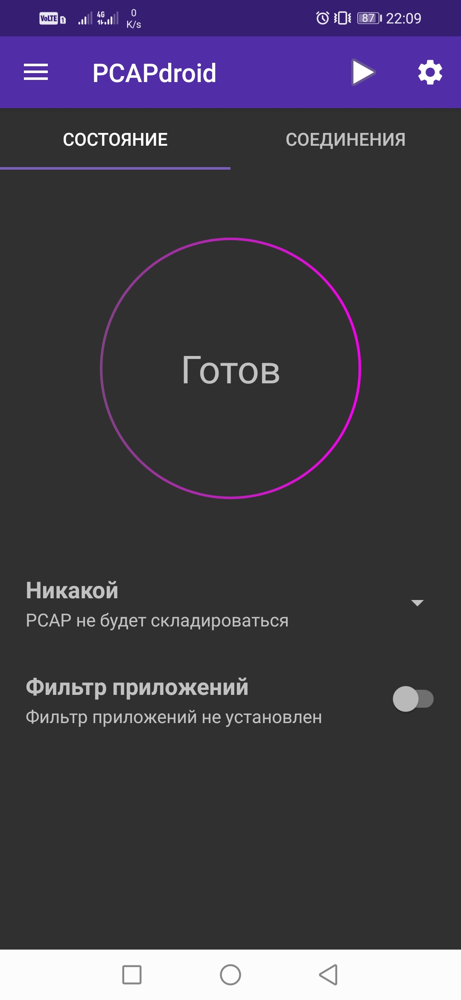
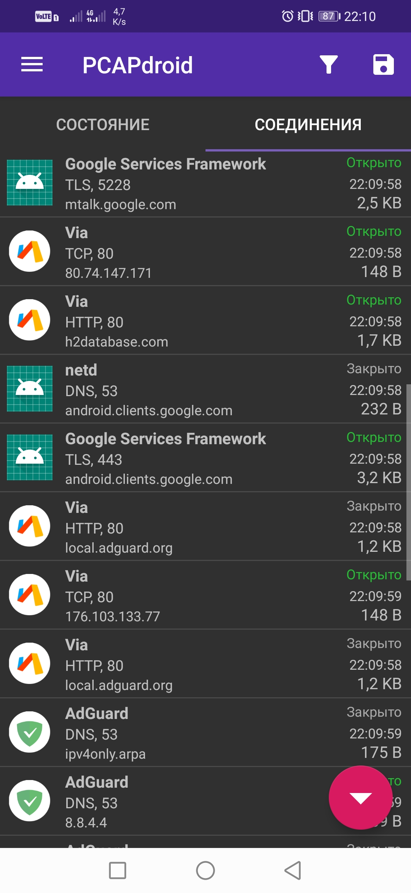
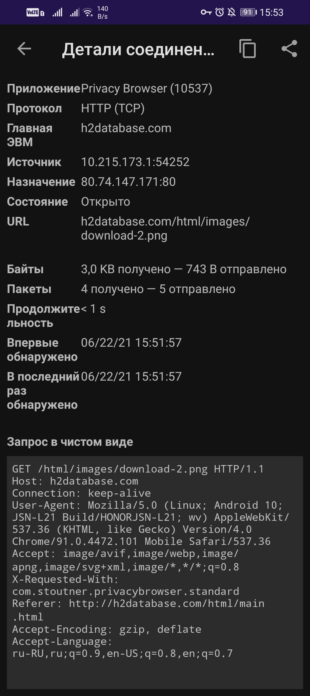
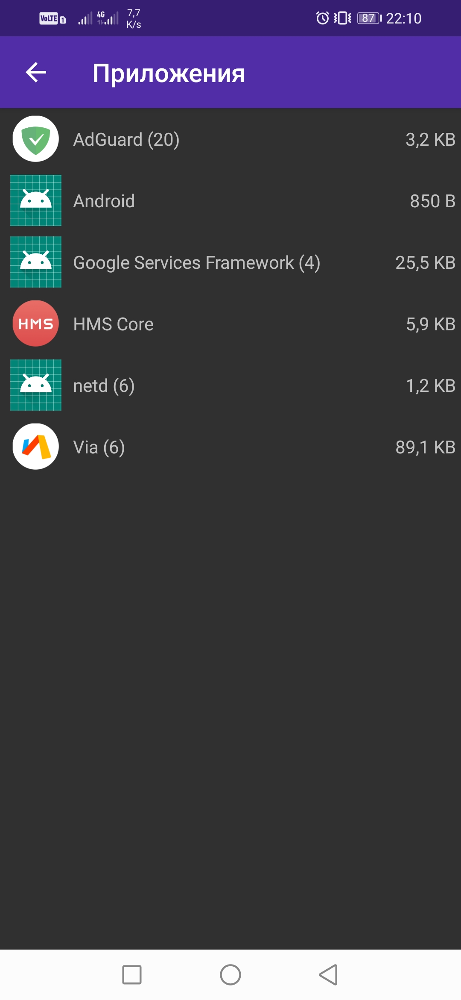

**[Оглавление](index) 	>	Знакомство**

## 1.1 Что такое PCAPdroid

PCAPdroid это инструмент с открытым исходным кодом, предназначенный для захвата и мониторинга собственного траффика без необходимости получения Root-прав на устройстве. Типичные сценарии использования:

- Анализ соединений, созданных приложениями установленными на устройстве (как пользовательскими, так и системными)
- Создание дампа сетевого траффика (PCAP-файл) приложения, которому вы не особо доверяете и последующий его анализ в стороннем приложении (например Wireshark на ПК)
- Расшифровка HTTPS/TLS траффика приложения с целью отладки или реверс-инженеринга

PCAPdroid является бесплатным и имеет открытый исходный код, не содержит рекламы и трекеров. Это всего лишь мощный инструмент для технически подкованных пользователей.

PCAPdroid использует [системный сервис VPN](https://developer.android.com/reference/android/net/VpnService) для получения всего траффика генерируемого Android-приложениями. Никаких серверов за пределами устройства не используется, благодаря механизму VPN приложение пропускает весь траффик через себя и благодаря этому позволяет получать данные для анализа.

**Важно**: PCAP-файл генерируемый приложением PCAPdroid не является на 100% корректным. Для получения сведений на этот счет посетите раздел [Надежность PCAP](quick_start#14-надежность-pcap).

## 1.2 Основы использования

Для того чтобы начать пользоваться PCAPdroid, Вам необходимо нажать на кнопку запуска захвата (треугольник слева от кнопки настроек).

При первом запуске будет отображен диалог подтверждения VPN соединения. После его подтверждения PCAPdroid начнет захватывать траффик. Далее вы можете оставить PCAPdroid работать в фоне, пока будете работать с необходимыми приложениями - он продолжит работу в виде сервиса до тех пор, пока Вы не остановите захват траффика. Все время работы PCAPdroid в шторке уведомлений будет отображаться значок ключа (обозначает VPN соединение), значок может отличаться в зависимости от системы - чистый Android, кастомные прошивки, оболочки от производителей и т.п. Более того, у вас будет отображаться постоянное уведомление, которое будет содержать некоторые детали о захвате траффика (объем траффика и количество соединений).

По умолчанию захватываемы траффик будет обрабатываться HTTP-сервером, запускающемся на порту 8080. Далее Вы можете посетить указанный URL с другого устройства (например ПК) и начать загрузку PCAP-файла. Вы будете увидеть прогресс загрузки как 0% потому, что браузер не знает какого размера целевой файл будет. Данные идут потоком, поэтому загрузка завершится сразу после того как Вы остановите захват траффика в PCAPdroid (т.е. поток прекратится). Так же следует помнить, что дамп полученный таким образом не содержит данных, сгенерированных приложениями до того, как браузер начал загрузку. 

**Важно:** HTTP-сервер отвечает на все запросы со стороны браузеров в локальной сети. Это означает что любой пользователь в вашей локальной сети попав на адрес HTTP-сервера (из PCAPdroid) может загрузить к себе копию вашего дампа! Если Вы хотите избежать этого, нажмите на "HTTP сервер" на главном экране приложения и выберите вариант "Никакой" или же "PCAP файл".

Весь захваченный траффик так же отображается во вкладке "Соединения".

Каждая строка представляет исходящее соединение сделанное приложением или системой. Отображаются следующие сведения:

  - Значок приложения либо вопросительный знак если приложение неопознано
  - Название приложения
  - Протокол соединения, порт и версию протокола IP (если это не IPv4). Эти данные определяются анализом пакетов с помощью [nDPI](https://github.com/ntop/nDPI).
  - The SNI (имя хоста к которому отправлено соединение) или DNS запрос, если доступно. В остальных случаях - целевой IP.
  - Статус соединения - индикатор имеет значения "Открыто", "Закрыто", "Ошибка" или "Недоступно".
  - Время последнего полученного пакета связанного с соединением.
  - Общее количество траффика связанного с соединением.

Нажав на строку соединения можно получить больше деталей о нем.

Во время захвата PCAPdroid держит всю информацию в памяти. По достижению предела, информация о старых соединениях будет удалена для освобождения памяти под новые соединения. Так же будет отображено сообщение о количестве удаленных по данной причине соединений. Общая информация о количестве траффика сгенерированного приложениями можно посмотреть в разделе "Приложения".

Нажав на строку с конкретным приложением Вы сможете посмотреть все соединения сделанные только этим приложением.

## 1.3 Фильтр приложений

По умолчанию PCAPdroid захватывает весь траффик устройства (все приложения). При необходимости Вы можете указать конкретное приложение траффик которого Вам нужен - для этого используйте "Фильтр приложений" на главном экране. После этого PCAPdroid будет захватывать траффик только указанного приложения. В основном это крайне полезно в купе с использованием [расшифровки TLS ](tls_decryption) чтобы убедиться что только нужный траффик будет декодирован.

## 1.4 Надежность PCAP

*Примечание: данная информация не касается [захвата траффика в Root режиме](advanced_features#44-захват-траффика-с-правами-root).*

PCAP генерируемый PCAPdroid содержит некоторые синтетические данные, которые могут быть ненадежными в случае детального анализа пакетов. В частности только полезная нагрузка (payload) пакета, одноранговые IP адреса и L3 порты являются актуальными данными. Это ограничение присуще способу используемому PCAPdroid, как и любому другому приложению ведущему захват без Root прав.

Некоторые из таких ограничений:

- Все пакеты приходящие из сети содержат синтетические IP и TCP/UDP заголовки
- Некотрые IP и TCP возможности могут быть отключены или иметь другую реализацию
- Размеры пакетов не соотвествуют исходным
