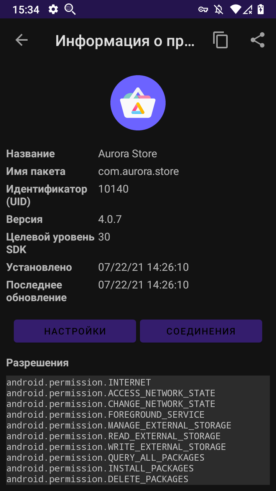
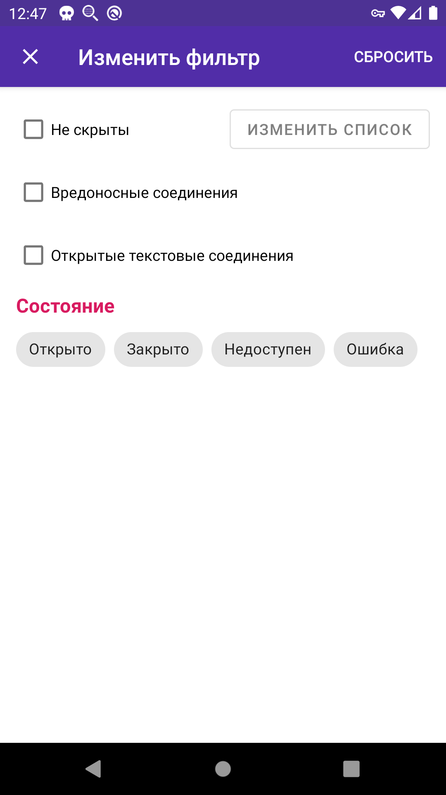

**[Оглавление](index) 	>	Знакомство**

## 1.1 Что такое PCAPdroid

PCAPdroid это инструмент с открытым исходным кодом, предназначенный для захвата и мониторинга собственного трафика без необходимости получения Root-прав на устройстве. Типичные сценарии использования:

- Анализ соединений, созданных приложениями установленными на устройстве (как пользовательскими, так и системными)
- Создание дампа сетевого трафика Android-устройства и его отправка на другое устройство для последующего анализа в стороннем приложении (например Wireshark на ПК)
- Расшифровка HTTPS/TLS трафика конкретного приложения

PCAPdroid использует [системный сервис VPN](https://developer.android.com/reference/android/net/VpnService) для получения всего трафика генерируемого Android-приложениями. Никаких серверов за пределами устройства не используется, благодаря механизму VPN приложение пропускает весь трафик через себя (локальная обработка) и благодаря этому позволяет получать данные для анализа.

Если вы планируете использовать PCAPdroid для проведения анализа пакетов, ознакомьтесь c  [соответствующим разделом](#14-packet-analysis) ниже.

## 1.2 Основы использования

Для того чтобы начать пользоваться PCAPdroid, Вам необходимо нажать на кнопку запуска захвата (треугольник слева от кнопки настроек).

При первом запуске будет отображен диалог подтверждения VPN соединения. После его подтверждения PCAPdroid начнет захватывать трафик. Далее вы можете оставить PCAPdroid работать в фоне, пока будете работать с необходимыми приложениями - он продолжит работу в виде сервиса до тех пор, пока Вы не остановите захват трафика. Все время работы PCAPdroid в шторке уведомлений будет отображаться значок ключа (обозначает активное VPN соединение), значок может отличаться в зависимости от системы - чистый Android, кастомные прошивки, оболочки от производителей и т.п. Более того, у вас будет отображаться постоянное уведомление, которое будет содержать некоторые детали о захвате трафика (объем трафика и количество соединений).

По умолчанию захватываемый трафик будет обрабатываться HTTP-сервером, запускающемся на порту 8080. Далее Вы можете посетить указанный URL с другого устройства (например ПК) и начать загрузку PCAP-файла. Вы будете видеть прогресс загрузки как 0% потому, что браузер не знает какого размера целевой файл будет. Данные идут потоком, поэтому загрузка завершится сразу после того как Вы остановите захват трафика в PCAPdroid (т.е. поток прекратится). Так же следует помнить, что дамп полученный таким образом не содержит данных, сгенерированных приложениями до того, как браузер начал загрузку. 

**Важно:** HTTP-сервер отвечает на все запросы со стороны браузеров в локальной сети. Это означает что любой пользователь в вашей локальной сети попав на адрес HTTP-сервера (из PCAPdroid) может загрузить к себе копию вашего дампа! Если Вы хотите избежать этого, нажмите на "HTTP сервер" на главном экране приложения и выберите вариант "Никакой" или же "PCAP файл".

Весь захваченный трафик так же отображается во вкладке "Соединения".

Каждая строка представляет исходящее соединение сделанное приложением или системой. Отображаются следующие сведения:

  - Значок приложения либо вопросительный знак если приложение не опознано
  - Название приложения
  - Протокол соединения, порт и версию протокола IP (если это не IPv4). Эти данные определяются анализом пакетов с помощью [nDPI](https://github.com/ntop/nDPI).
  - The SNI (имя хоста к которому отправлено соединение) или DNS запрос, если доступно. В остальных случаях - целевой IP.
  - Статус соединения - индикатор имеет значения "Открыто", "Закрыто", "Ошибка" или "Недоступно".
  - Время последнего полученного пакета связанного с соединением.
  - Общее количество трафика связанного с соединением.

Нажав на строку соединения можно получить больше деталей о нем.

Некоторые детали, а именно IP-адрес, статус и статистика показываются всегда. Другая информация, например URL связанный с соединением отображается только когда это возможно. Так же PCAPdroid по возможности отображает данные переданные в открытом виде в начале соединения. Например в случае HTTP соединений будет так же отображен сам HTTP-запрос.

Во время захвата PCAPdroid держит всю информацию в памяти. По достижению предела, информация о старых соединениях будет удалена для освобождения памяти под новые соединения. Так же будет отображено сообщение о количестве удаленных по данной причине соединений. Общая информация о количестве трафика сгенерированного приложениями можно посмотреть в разделе "Приложения".

Нажав на строку с приложением, вы увидите окно с информацией, где будут отображены:

- даты установки/обновления
- UID
- название приложения
- имя пакета
- версия
- целевая версия SDK
- список разрешений

Нажав на кнопку "Настройки", Вы попадете в системные настройки для выбранного приложения. Кнопка "Соединения" в свою очередь покажет все соединения сделанные приложением.

## 1.3 Фильтры

Перед запуском захвата трафика, во вкладке "Состояние" можно выбрать целевое приложение (трафик которого необходим) посредством опции "Фильтр приложений". В таком случае лишь трафик выбранного приложения будет проходить через PCAPdroid. В основном это крайне полезно вместе с использованием [расшифровки TLS ](tls_decryption) чтобы убедиться, что будет расшифрован только нужный трафик.

После запуска захвата, PCAPdroid предоставляет несколько способов отфильтровать отображаемые соединения:

- через строку поиска можно отфильтровать соединения по IP-адресу, хосту, протоколу, названию приложения или значению UID. Удобный способ использования этого фильтра - найти нужное соединение, открыть его контекстное меню (удерживание нужной строки) и затем выбрать вариант "Поиск". Вам будут предложены варианты поиска указанным выше критериям кроме UID
- одним из фильтров в диалоге "редактировать фильтр" (во вкладке соединений кнопка фильтра в верхней панели)
- при удерживании конкретного соединения в контекстном меню будет вариант "скрыть". Все скрытые таким образом соединения добавляются в "список скрытых соединений", просмотреть и изменить который можно из диалога выбора фильтров
- в окне "Приложения" (в боковом меню) можно увидеть все приложения трафик которых был захвачен к текущему моменту. Таким образом можно увидеть все соединения сделанные выбранным приложением.

Фильтр "Скрытые соединения" позволяет создавать правила по которым из общего списка соединений будут скрываться целые группы. Если правильно настроить белый список, то можно скрыть из списка ненужные соединения (прим. проверка обновлений, загрузка профиля и т. д.), оставляя тем самым только нужную часть трафика. Таким образом упрощается обнаружение целевых соединений (отсеяв ненужные) и поиск посторонней активности (нежелательные или даже потенциально опасные соединения). Данный список сохраняется на постоянной основе (не будет утерян после остановки захвата трафика).

Соединения попадающие под фильтры белого списка по прежнему захватываются PCAPdroid, просто не отображаются в списке. Во вкладке соединения наверху есть кнопка с иконкой глаза - нажатие на данную кнопку позволяет отобразить/скрыть соединения попадающие под фильтры белого списка. Независимо от того отображаются они или нет, данные соединения попадут в результирующий дамп (PCAP-файл) и будут видны при анализе сторонними инструментами.

Белый список существует постоянно (не только в контексте захвата), а так же может быть отредактирован в соответствующем окне, перейти к которому можно из бокового меню.

Диалог изменения фильтров позволяет указать следующие фильтры для списка соединений:

- *Не скрыты* - отобразятся все соединения за исключением тех что были скрыты пользователем
- *Вредоносные соединения* - отображать только вредоносные соединения. Этот пункт отображается если активирована функция [обнаружение вредоносных соединений](paid_features#)
- *Открытые текстовые соединения* - отображать только соединения которые содержат запрос в чистом виде (они не зашифрованы и данные из них можно отобразить текстом)
- *Состояние* - отображать соединения только с выбранным состоянием

## 1.4 Анализ пакетов

Если вам необходимо провести низкоуровневый анализ пакетов (заголовки сетевого (L3) или транспортного (L4) уровня) или их размеры/тайминги, тогда захват в обычном режиме может не подойти для ваших целей. Вместо него необходимо использовать [захват траффика в Root-режиме](advanced_features#44-захват-траффика-с-правами-root), который предоставляет данные по трафику устройства "как есть" без каких-либо модификаций.

При обычном захвате (без root-прав) несколько изменяет данные, что является необходимым шагом при использовании VpnService. Изменения затрагивают только L3 и L4 уровни, в то время как прикладной (L7) уровень остается нетронутым.

В частности происходят следующие изменения:

- Все пакеты приходящие из сети содержат синтетические IP и TCP/UDP заголовки. Только IP адрес и порт назначения содержат актуальную информацию.
- При проксировании соединений некоторые возможности IP и TCP могут быть отключены или действовать по другому.
- Так как PCAPdroid проксирует соединения используя транспортные (L4) сокеты, размеры пакетов приходящих из интернета не соответствуют реальным.

Для получения объяснения технических деталей о причинах такого поведения, просьба ознакомиться с документом ["Как это работает" (на англ. языке)](https://github.com/emanuele-f/PCAPdroid/blob/master/docs/how_it_works.md).
