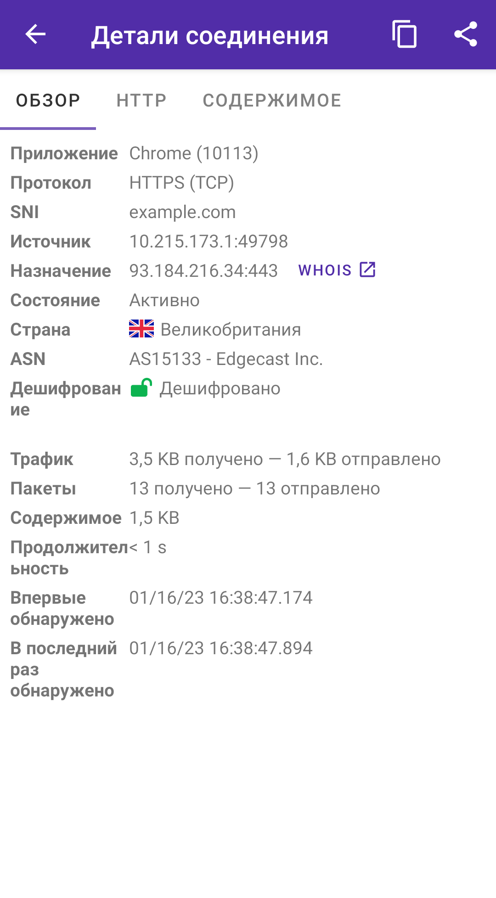
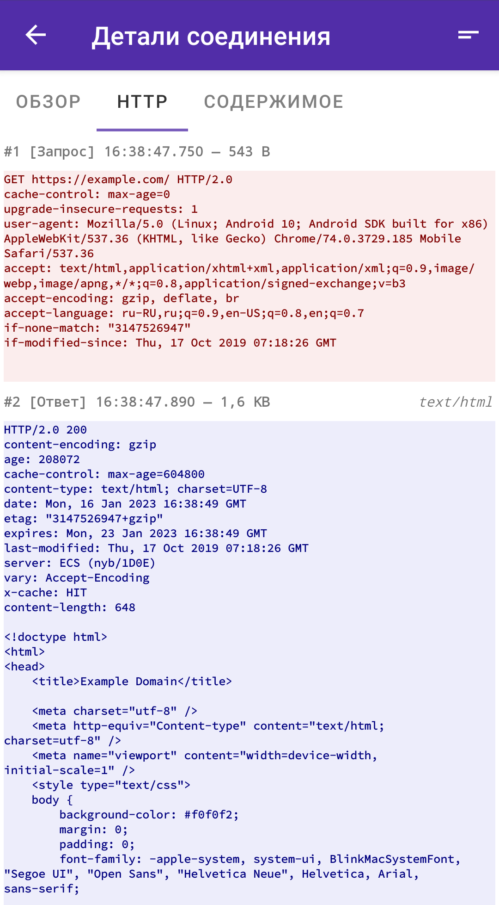
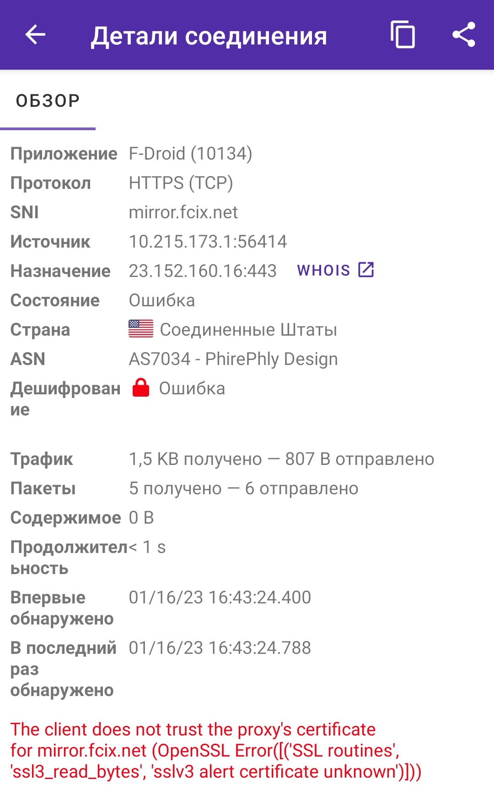
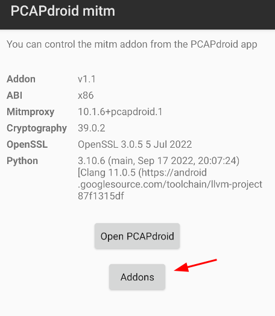
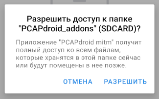
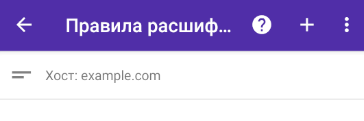
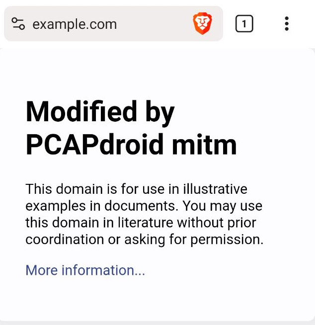
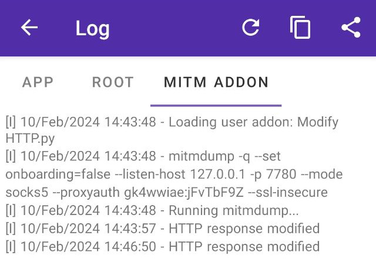

**[Оглавление](index) > Дешифрование TLS**


## 3.1 Введение

PCAPdroid can decrypt the TLS traffic and display the decrypted payload directly into the app. Moreover, it can [generate a pcapng file](paid_features#53-pcapng-format), which you can load in tools like Wireshark to analyze the decrypted traffic.

Большинство приложений сегодня работают через TLS, чтобы защитить свои данные от наблюдения и изучения. Такие соединения в PCAPdroid помечаются как TLS, либо HTTPS протокол.
Дешифрование может быть полезным в следующих случаях:

- Проверить, отправляет ли приложение конфиденциальную информацию или пароли в чистом виде
- Реверс-инжиниринг протокола приложения, например с целью узнать адреса REST API
- Отладка проблем связанных с протоколом без выключения TLS шифрования

**Примечание**: перед дешифрованием вам необходимо проверить условия использования приложения, чтобы узнать разрешено ли это

**Примечание**: запуск дешифрования TLS снизит безопасность вашего приложения. Вы должны делать это только если знаете что делаете, а также в течение ограниченного времени

Текущие ограничения:

- Дешифрование QUIC трафика [пока еще не поддерживается](https://github.com/mitmproxy/mitmproxy/issues/4170). В PCAPdroid вы можете включить блокировку QUIC протокола, что в случае некоторых приложений заставляет их [вернуться к использованию TLS](https://www.ietf.org/archive/id/draft-ietf-quic-applicability-09.html#section-2), таким образом делая эти приложения дешифруемыми
- Дешифрование STARTTLS [пока еще не поддерживается](https://github.com/mitmproxy/mitmproxy/issues/4215)
- Есть также некоторые специфичные для разных протоколов ограничения, обратитесь к [документации mitmproxy](https://docs.mitmproxy.org/stable/concepts-protocols/#protocols) за деталями

Дешифрование TLS на Android не является легкой задачей, определенные технические знания и знакомство с данной темой необходимо. Есть множество подводных камней, которые будут обсуждены ниже. Также, устройство с root-правами поможет достичь успеха в большинстве случаев.


## 3.2 Начальная настройка

Дешифрование TLS может быть включена из настроек PCAPdroid.

         В настройках PCAPdroid (значок ⚙️ в верхнем правом углу), включите переключатель **Дешифрование TLS** в разделе **Просмотр трафика**.

При первом включении, помощник настройки поможет вам правильно настроить дешифрование. Этот процесс включает в себя следующие шаги:

1. Загрузка и установка [дополнения PCAPdroid-mitm](https://github.com/emanuele-f/PCAPdroid-mitm). Фактически, процесс дешифрования производится [mitmproxy](https://github.com/mitmproxy/mitmproxy), который встроен в дополнение
2. Разрешение на управление mitm-дополнением. Это мера безопасности для предотвращения контроля дополнения другими приложениями.
3. Установка [корневого сертификата](https://docs.mitmproxy.org/stable/concepts-certificates). Корневой сертификат, это то, что позволяет PCAPdroid дешифровать трафик приложения, и чтобы сделать это, его (прим. корневой сертификат) необходимо сначала добавить в хранилище сертификатов. Для обеспечения безопасности, прямо на устройстве генерируется уникальный корневой сертификат  (прим. сертификат с другого устройства не подойдет).

Перед продолжением, проверьте имеет ли ваше устройство приложение для контроля автозапуска и фоновой активности приложений, как например [Autostart на устройствах vivo](https://www.vivo.com/en/support/questionByTitle?title=How%20to%20turn%20on/off%20Autostart%20for%20my%20apps) или раздел [Батарея на устройствах Huawei](https://consumer.huawei.com/ru/support/content/ru-ru00428704/). Если в вашей системе есть подобное приложение, вам необходимо разрешить для mitm-дополнения доступные опции запуска (например автозапуск, запуск другими приложениями) и работу в фоне. Иначе PCAPdroid не сможет запустить процесс дешифрования.


## 3.3 Дешифрование

Для дешифрования соединений необходимо определить некоторые правила. Вы можете сделать это из раздела "Правила расшифровки" в боковом меню, либо через долгое нажатие на соединение и выбор критерия дешифрования из контекстного меню. Заметьте, что в силу мер безопасности ОС Android, дешифрование наиболее распространенных приложений обычно не будет работать, и более того - приведет к прекращению корректной работы приложения (что будет выражаться в ошибках соединения). Изучите следующий раздел чтобы понять и, возможно, преодолеть эти ограничения.

Для того, чтобы убедиться, что дешифрование работает, выберите целевым приложение которое наверняка можно дешифровать. Хорошим кандидатом на эту роль является Google Chrome. Включите дешифрование, выберите Chrome как целевое приложение и начните захват трафика в PCAPdroid. В Chrome откройте любой HTTPS сайт в новой вкладке, после чего вы должны увидеть дешифрованные данные соединений в PCAPdroid. Они обозначены значком зеленого открытого замка.

Значко замка и цвет являются индикаторами статуса дешифрования, который так же указывается и в деталях соединения:

- *зеленый*: дешифровано успешно
- *красный*: дешифрование не удалось. Откройте детали соединения и вы увидете сообщение об ошибке, описывающее почему дешифрование не увенчалось успехом.
- *оранжевый*: дешифрование не поддерживается для данного протокола или приложения (например, для протокола QUIC и некоторый специфичных приложений, см. ниже)
- *серый открытый замок*: соединение не зашифровано (например, чистый DNS)
- *серый закрытый замок*: дешифрование еще не доступно (т.е. не настроено соответствующих правил, либо прикладные данные еще ожидаются)

Вы можете отобразить дешифрованные соединения, а также те для которых дешифрование не удалось, с помощью фильтров.
Если вы откроете дешифрованное соединение, вкладки "Содержимое" и "HTTP" отобразят дешифрованное содержимое.

<p align="center">


</p>

Если запись дампа в PCAP включена, то по завершению захвата вы увидите запрос на сохранение `SSLKEYLOGFILE`, который вы можете загрузить в Wireshark [для дешифрования](https://wiki.wireshark.org/TLS#tls-decryption) PCAP файла. В качестве альтернативы, для упрощения процесса, можно использовать [формат дампа pcapng](paid_features#53-pcapng-format), в который `SSLKEYLOGFILE` встраивается напрямую.

### 3.3.1 Исключение определенных хостов/портов

Правила дешифрования позволяют вам определить что необходимо дешифровать. Тем не менее, в некоторых случаях бывает проще создать правило для дешифрования всего приложения и исключить из него определенные хосты или порты.
Для этой цели вы можете использовать [опцию --ignore-hosts](https://docs.mitmproxy.org/stable/howto-ignoredomains/#ignore_hosts), указав ее в настройках PCAPdroid в пункте "Дополнительные опции mitmproxy"

Например, чтобы исключить из дешифрования соединения с портом 1234, вы можете использовать`--ignore-hosts .*:1234`.


## 3.4 Подводные камни и возможные решения

Google Chrome является относительно простым для дешифрования приложением. Если вы попробуете дешифровать другие приложения, вы вскоре столкнетесь с некоторыми проблемами, которые в большинстве случаев можно решить с помощью устройств с root-правами и правильными инструментами.

### 3.4.1 Клиент не доверяет mitm сертификату

<p align="center">

</p>

Если вы видите ошибку *client does not trust the proxy's certificate* при дешифровании, это может случиться по следующим причинам:

- Начиная с ОС Android 7, приложения с целевым Android SDK 23 и выше больше не доверяют любым пользовательским сертификатам и полагаются только на системные сертификаты, т.е. те, которые идут предустановленными на устройстве

- Приложение может использовать свою внутреннюю базу корневых сертификатов. Некоторые приложения (преимущественно браузеры) реализуют кастомное хранилище доверенных сертификатов отдельно от системного. Это не даст им использовать какие-либо сертификаты из хранилища вашего устройства. Проверьте наличие возможности отключения такого хранилища. К примеру в Firefox [вы можете сделать это](https://support.mozilla.org/ru/questions/1304237) через `about:config`. Если подобной возможности нет, остается только патчить приложение.

- Приложение может реализовывать такую меру безопасности, как [привязка к сертификату](https://developer.android.com/training/articles/security-ssl#Pinning), что будет означать активную валидацию сертификатов относительно встроенного в приложение белого списка. Обычно это задается через файл `network_security_config.xml` в коде приложения. Возможные решения для этого случая будут обсуждаться в дальнейших разделах

#### Использование Android-устройства с root-доступом

- На устройстве с root-правами и Magisk, вы можете установить [модуль Custom Certificate Authorities](https://github.com/whalehub/custom-certificate-authorities) (Android 11+) или [модуль MagiskTrustUserCerts](https://github.com/NVISOsecurity/MagiskTrustUserCerts), после чего установить [хешированный сертификат](https://docs.mitmproxy.org/stable/howto-install-system-trusted-ca-android/#instructions) (замените `mitmproxy-ca-cert.cer` на название сертификата от PCAPdroid) в качестве системного сертификата. Данное решение **рекомендуется** если у вас есть Magisk.

- На любом устройстве с root-правами вы можете установить сертификат [в системное хранилище](https://docs.mitmproxy.org/stable/howto-install-system-trusted-ca-android/#3-insert-certificate-into-system-certificate-store), предварительно примонтировав системный раздел в режиме `rw`

- В качестве альтернативы вы можете установить [LSposed](https://github.com/LSPosed/LSPosed). Затем потребуется установить модуль [sslunpinning](https://github.com/Xposed-Modules-Repo/io.github.tehcneko.sslunpinning/releases)

- Вы можете использовать [VirtualXposed](https://github.com/android-hacker/VirtualXposed) чтобы виртуализировать целевое приложение (тогда оно запустится как будто его целевой SDK имеет значение 23). Android 11 и новее [пока еще не поддерживаются](https://github.com/android-hacker/VirtualXposed/issues/1073). Чтобы использовать данный метод, откройте VirtualXposed, выберите "Добавить приложение" и установите то приложение, трафик которого вы хотите дешифровать (при запросе метода установки используйте метод "virtualxposed"). Затем, в PCAPdroid, выберите VirtualXposed в качестве целевого приложения для дешифрования. К сожалениею виртуализация довольно ненадежный метод, поэтому стоит ожидать вылетов целевого приложения (прим. установленного внутри VirtualXposed)

#### Использование Android-эмулятора с root-доступом

Если вы не хотите получать root на своем устройстве, либо не можете этого сделать, вы можете попробовать те же шаги на Android-эмуляторе - это должно дать идентичный результат. Рекомендуется использовать Android-эмулятор поставляемый через менеджер виртуальных устройств из Android Studio, т.к. он предоставит возможность выбора эмулятора любой SDK-версии. Как настроить эмулятор и получить root-доступ на нем показано в [видео-туториале](https://www.youtube.com/watch?v=QzsNn3GhYYk)

#### Патчинг APK

- Вы можете использвать [apk-mitm](https://github.com/shroudedcode/apk-mitm), который автоматизирует пересборку apk с отключенной привязкой к сертификатам и подписывает его для установки

- Другой утилитой, которая может оказаться полезной, является [android-unpinner](https://github.com/mitmproxy/android-unpinner) у которого могут быть некоторые преимущества относительно apk-mitm

- Вы можете использовать [apktool](https://ibotpeaches.github.io/Apktool), чтобы декомпилировать приложение, снизить значение целевого SDK до 23 и пересобрать приложение

- Если у вас есть исходный код приложения и вы можете сами его собрать, обратитесь к [документации Android](https://developer.android.com/training/articles/security-config.html) чтобы настроить доверие к корневому сертификату PCAPdroid. В XML конфигурации сетевой безопасности, вы можете указать домены верхнего уровня, например, `<domain includeSubdomains="true">com</domain>` чтобы использовать корневой сертификат для mitm атаки на любой `.com` домен. Чтобы указать сертфикат, переименуйте в `pcapdroid.crt` корневой сертификат PCAPdroid, экспортированный в процессе настройки дешифрования TLS. Затем поместите его в папку `raw` ресурсов. Пожалуйста помните о том, что некоторые библиотеки также могут использовать стороннее хранилище доверенных сертификатов - обратитесь к их документации по данному вопросу

#### Реверс-инжиниринг и другие продвинутые темы

- Если ничего из вышеперечисленного не помогло, значит приложение вероятно использует кастомную логику привязки. В этом случае необходимо декомпилировать приложение, проанализировать код, пропатчить его и пересобрать. Чаще всего для декомпиляции и патчинга используют такое ПО как [JADX](https://github.com/skylot/jadx), [apktool](https://ibotpeaches.github.io/Apktool) или [расширение APKLab](https://github.com/APKLab/APKLab) для Visula Studio Code. Обратитесь к данному [посту в блоге](https://braincoke.fr/blog/2021/03/android-reverse-engineering-for-beginners-decompiling-and-patching/) для полного гайда в тему реверс-инжиниринга и декомпиляции приложение с использованием упомянутых инструментов

- Помимо патчинга Android-приложения, вы можете прибегнуть к таким инструментам, как [Objection](https://github.com/sensepost/objection) и [Frida](https://github.com/frida/frida). Полноценный гайд по использованию данных инструментов вы можете найти в данном [видео-туториале](https://www.youtube.com/watch?v=R3ptGaFW1AU). Вместо использования Burp Suite (как в туториале) вы можете использовать `pcapdroid-mitm` или внешний `mitmproxy`, если ваша цель заключается в дешифровании TLS трафика

- Вы можете обратиться к сайту [OWASP](https://mas.owasp.org/MASTG/0x04c-Tampering-and-Reverse-Engineering/#references), посвященному безопасности мобильных приложений. Там есть репозиторий [инструментов](https://mas.owasp.org/MASTG/tools/) для пентеста и реверс-инжиниринга мобильных приложений с подробным описанием. Для дополнительной информации вы можете обращаться к различным туториалам OWASP по невзламываемым приложениям на YouTube.

### 3.4.2 Прозрачность сертификата

При дешифровании трафика браузера, браузер может отказаться от соединения с сайтами, сообщая об ошибке связанной с прозрачностью сертификатов. С контролем [прозрачности сертификатов](https://en.wikipedia.org/wiki/Certificate_Transparency), сторонние корневые сертификаты добавленные в систему обычно отвергаются. Чтобы исправить это, необходимо:

- В некоторых браузерах, вы можете отключить контроль прозрачности сертификатов, например, в Bromite посредством опций в `chrome://flags`
- Удалите корневой сертификат PCAPdroid из системного хранилища или просто временно выключите его из настроек безопасности в Android
- Если корневой сертификат PCAPdroid установлен в системное хранилище посредством какого-либо Magisk-модуля, тогда вы можете использовать *magisk hide* на браузер, чтобы он распознавал сертификат PCAPdroid не как системный

### 3.4.3 трафик все еще зашифрован

После дешифрования TLS трафика, содержимое все еще может быть зашифровано с использованием других протоколов. Это происходит, в частности, с Telegram и Whatsapp, которые используют свой собственный протокол шифрования. Подобные протоколы требуют разработки собственных инструментов для дешифрования, что выходит за рамки PCAPdroid.

Более того, помните что результат дешифрования может оказаться *бинарный* протокол, который не имеет удобо-читаемого для человека представления. Важно понимать, что *бинарный* протокол не обязательно означает что он зашифрован. Например, DNS является бинарным протоколом, но он не зашифрован.


## 3.5 Дешифрование через внешний mitmproxy

Для большей гибкости, к примеру, чтобы модифицировать трафик или использовать вышестоящий прокси, вы можете производить дешифрование TLS на любом другом SOCKS5 прокси, возможно запущенном на другом устройстве. Ниже пример того, как настроить для этого `mitmproxy`.

На ПК вы можете установить `mitmproxy` следуя [официальной инструкции по установке](https://docs.mitmproxy.org/stable/overview-installation). Оба устройства (ПК и Android с запущенным PCAPdroid) должны быть подключены к одной сети для этого. В качестве альтернативы, вы можете установить `mitmproxy` прямо на Android устройство в `termux`. После установки приложения `termux`, откройте его и выполните следующие команды:

```bash
pkg update
pkg install python openssl-1.1-static
python3 -m pip install --upgrade pip

CRYPTOGRAPHY_DONT_BUILD_RUST=1 CRYPTOGRAPHY_SUPPRESS_LINK_FLAGS=1 \
  LDFLAGS="$PREFIX/lib/openssl-1.1/libssl.a $PREFIX/lib/openssl-1.1/libcrypto.a" \
  CFLAGS="-I$PREFIX/include/openssl-1.1" \
  pip install mitmproxy==7.0.4
```

Это установит `mitmproxy` версии 7.0.4, который является последней версией, не требующей `rust`. Если вы хотите установить версию 8+, следуйте [данным инструкциям](https://t.me/PCAPdroid/10071).

**Примечание**: при установки на Android устройство посредством termux, необходимо выбрать конкретное целевое приложение, чтобы не захватывать трафик других приложений. В ином случае трафик из termux зациклится, лишив тем самым устройство подключения к интернету.

После установки `mitmproxy`, необходимо выполнить следующие шаги:

1. Запустить `mitmproxy` без каких-либо опций, тогда он сгенерирует mitm сертификат. Установите сертификат (обычно расположен в `~/.mitmproxy/mitmproxy-ca-cert.cer`) на Android устройстве. Возможно, для этого потребуется заменить расширение `.cer` на расширение `.crt`
2. Откройте настройки PCAPdroid
3. Активируйте опцию "Включить SOCKS5 прокси"
4. Укажите IP адрес и порт для будущего экземпляра mitmproxy (порт 8050 в этом примере)
5. Запустите mitmproxy в режиме SOCKS5, с помощью команды `mitmproxy --mode socks5 --listen-port 8050`

С этого момента PCAPdroid будет перенаправлять весь TCP трафик на mitmproxy сервер, который будет проксировать соединения и дешифровывать TLS трафик. Однако помните, что генерируемый в PCAPdroid дамп по прежнему будет содержать зашифрованный трафик вместе с оригинальными IP адресами назначения и портами.

## 3.6 Пользовательские аддоны для mitmproxy

Начиная с версии PCAPdroid 1.7.0 вы можете загружать пользовательские [аддоны для mitmproxy](https://docs.mitmproxy.org/stable/addons-overview). На примере ниже продемонстрировано как сделать это для модификации HTTP-ответа от сайта.

Прежде всего необходимо указать директорию, из которой будут загружаться аддоны. Для этого предварительно создайте на устройстве эту директорию (в данном примере - `/sdcard/PCAPdroid_addons`), после чего откройте PCAPdroid mitm, нажмите на "Addons" и затем на "Set user dir" в меню опций (правый верхний угол экрана).


<p align="center">

</p>

<p align="center">

</p>

Нажмите "Разрешить" чтобы предоставить PCAPdroid права на чтение из данной папки.

<p align="center">

</p>

По умолчанию пользовательские аддоны запускаются в приватной папке, которая не доступна другим приложениям. Если вы хотите, чтобы ваши аддоны читали или записывали файлы общедоступные файлы, к примеру в папке `/sdcard` или в выбранной для аддонов папке, выберите "Enable files access" из того же гамбургер-меню и выдайте необходимые разрешения.

В выбранной для аддонов папке создайте следующий скрипт (либо создайте его на ПК и перенесите в выбранную директорию с помощью `adb push "Modify HTTP.py" /sdcard/PCAPdroid_addons`):

```python
# Modify HTTP.py

class ModifyHttp:
    def done(self):
        # Выполняется перед выгрузкой аддона из памяти, здесь следует закрывать глобальные ресурсы (открытые файлы и т.д.)
        pass

    def response(self, flow):
        if flow.request.pretty_url == "https://example.com/":
            flow.response.content = flow.response.content.replace(
                b"Example Domain",
                b"Modified by PCAPdroid mitm")

            print("HTTP response modified")

addons = [ModifyHttp()]
```

Данный аддон будет модифицировать HTTP-ответ сайта [https://example.com](https://example.com), изменяя заголовок "Example Domain" на "Modified by PCAPdroid mitm".

После копирования скрипта в директорию, нажмите иконку обновления сверху, чтобы аддон отобразился в списке. Теперь включите его с помощью переключателя и запустите захват трафика в PCAPdroid с включенной опцией TLS дешифрования.

<p align="center">

</p>

Аддон сработает только на дешифрованном соединении, поэтому не забудьте создать правило дешифрования либо для домена `example.com`, либо для приложения браузера.
<p align="center">

</p>

Теперь, открывая https://example.com, вы должны увидеть заголовок "Modified by PCAPdroid mitm".

<p align="center">

</p>

**Примечание**: браузер может кешировать HTTP-ответы, поэтому возможно потребуется очистить кеш браузера. Для предотвращения кеширования вы можете добавить опцию `--anticache` в "Дополнительные опции mitmproxy".

**Примечание**: правило дешифрования необходимо настраивать для любых манипуляций с трафиком посредством аддонов, иначе трафик идет мимо mitmproxy и, соответственно, аддоны не смогут производить обработку.

Логи mitm дополнения также будут содержать текст "HTTP response modified", благодаря `print` в коде аддона.

<p align="center">

</p>

Ознакомьтесь с разделами [аддоны](https://docs.mitmproxy.org/stable/addons-overview) и [события](https://docs.mitmproxy.org/stable/api/events.html) в `mitmproxy` чтобы узнать больше про API, который вы можете использовать в аддонах.
